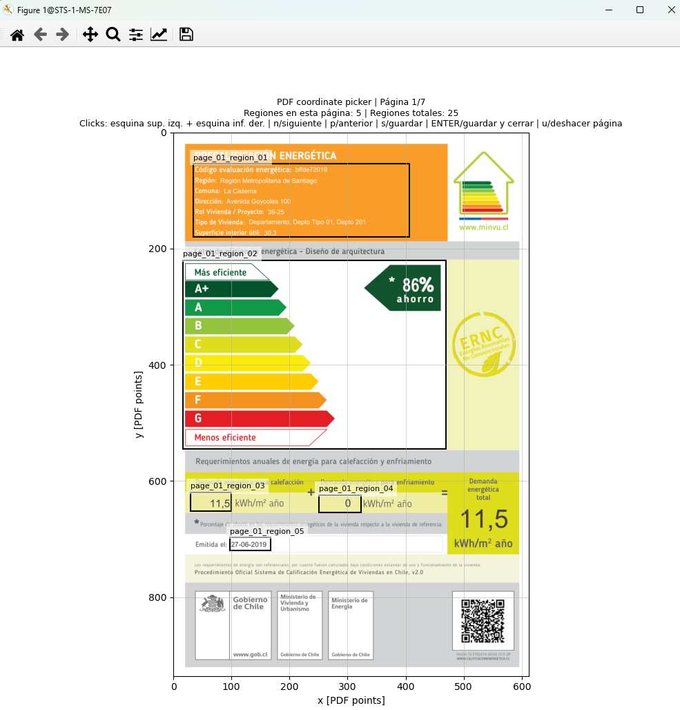
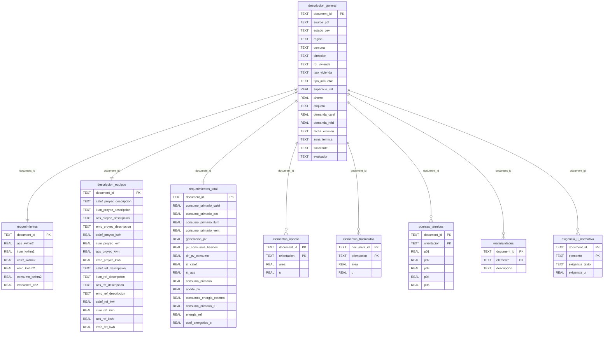

# Guia de procesamiento de PDFs y generacion de SQLite

Esta guia explica como se procesan las fichas PDF CEV, como se usan las regiones de extraccion y como se genera la base SQLite consolidada.

## Insumos

El procesamiento usa tres insumos principales:

- PDFs descargados en `cev_pdf_dir`.
- Regiones de extraccion en `pdf_regions_path`, actualmente `config/table_regions.json`.
- Rutas de salida definidas en `config/paths.yaml`, especialmente `pdf_extract_out_dir` y `cev_db_path`.

Las imagenes siguientes son la ficha de referencia exportada a JPG. Sirven para documentar visualmente que informacion aparece en cada pagina y sobre que estructura se marcaron las regiones.


## Marcado de regiones

El archivo `config/table_regions.json` fue generado con `scripts/pdf_coord_picker_multipage.py`. Ese script abre un PDF de referencia y permite dibujar rectangulos por pagina. Cada rectangulo queda guardado con coordenadas PDF y un identificador como `page_01_region_01`.

La interfaz del picker muestra la pagina renderizada del PDF y superpone las regiones ya definidas. Al seleccionar o crear rectangulos, el script registra las coordenadas en puntos PDF y las guarda en el JSON de regiones.



Para revisar o regenerar las regiones:

```bash
python scripts/pdf_coord_picker_multipage.py \
  --pdf ruta/a/ficha_referencia.pdf
```

Por defecto el JSON se guarda en la ruta `pdf_regions_path` definida en `config/paths.yaml`. Tambien puedes indicar una salida explicita:

```bash
python scripts/pdf_coord_picker_multipage.py \
  --pdf ruta/a/ficha_referencia.pdf \
  --out config/table_regions.json
```

## Extraccion y compilacion

El script principal de procesamiento es `scripts/extract_visible_rows_and_build_db.py`:

```bash
python scripts/extract_visible_rows_and_build_db.py --recursive
```

Si no pasas rutas, el script toma desde `config/paths.yaml`:

- `cev_pdf_dir` como carpeta de entrada.
- `pdf_regions_path` como configuracion de regiones.
- `pdf_extract_out_dir` como carpeta de salida intermedia.
- `cev_db_path` como base SQLite final.

Para una ejecucion manual con rutas explicitas:

```bash
python scripts/extract_visible_rows_and_build_db.py \
  --input-dir data/raw/cev_fichas \
  --recursive \
  --regions config/table_regions.json \
  --out-dir data/interim/output_cev_compiled \
  --db data/processed/cev_compiled.sqlite
```

## Procesamiento supervisado por lotes

Para lotes grandes conviene usar `scripts/run_cev_supervised.py`, que llama al extractor PDF por PDF y registra fallos sin detener todo el proceso:

```bash
python scripts/run_cev_supervised.py \
  --folder-mtime-before "2026-05-11 17:00:00" \
  --progress-every 100
```

Este runner tambien usa `config/paths.yaml` por defecto. El log de fallos se escribe en `failed_processing_log_path`.

## Seleccion de documentos procesables

Antes de construir la base SQLite se hizo una revision estadistica de la estructura de las fichas descargadas, contando cuantas paginas tenia cada documento. Ese diagnostico mostro que existian dos formatos principales: fichas de 4 paginas y fichas de 7 paginas.

Las fichas de 4 paginas corresponden a una version antigua del informe CEV y contienen menos informacion que el formato de 7 paginas. Como el extractor fue disenado sobre las regiones del formato completo de 7 paginas, se descarto el procesamiento de los documentos de 4 paginas para evitar registros incompletos o no comparables.

En total se identificaron 262.913 fichas. De ellas, 33.940 tenian 4 paginas, equivalente a 12,9% del total, y no fueron incorporadas a la base de datos. El resto corresponde a fichas de 7 paginas y constituye el universo procesado para la SQLite consolidada.

## Como se construye la base SQLite

El extractor abre cada PDF con PyMuPDF, valida que tenga 7 paginas y recorre las regiones definidas en `table_regions.json`. Para cada region obtiene texto visible, limpia valores numericos y arma registros estructurados.

La base se inicializa con tablas tematicas:

- `descripcion_general`: identificacion del documento, region, comuna, direccion, tipo de vivienda, tipo de inmueble, superficie, etiqueta y datos generales.
- `requerimientos`: consumos por ACS, iluminacion, calefaccion, ERNC, consumo total y emisiones.
- `descripcion_equipos`: descripcion y consumo de equipos de proyecto y referencia.
- `requerimientos_total`: consumos primarios, aportes fotovoltaicos, solar termico y coeficiente energetico.
- `elementos_opacos`: areas y transmitancias por orientacion.
- `elementos_traslucidos`: ventanas u otros elementos traslucidos por orientacion.
- `puentes_termicos`: valores por orientacion y tipo de puente termico.
- `materialidades`: descripcion de materialidades por elemento constructivo.
- `exigencia_u_normativa`: exigencias normativas de transmitancia por elemento.

Cada tabla usa `document_id` como llave principal o como parte de una llave compuesta. El script usa `INSERT OR REPLACE`, por lo que volver a procesar un PDF actualiza sus registros en la base.

El campo `tipo_inmueble` es una clasificacion derivada a partir de `tipo_vivienda`. Se calcula en el notebook `scripts/corregir_tipo_inmueble_cev.ipynb`: primero normaliza el texto de `tipo_vivienda`, luego busca patrones asociados a departamentos (`departamento`, `depto`, `edificio`, `torre`, `condominio`, `duplex`), casas pareadas o continuas (`pareada`, `pareado`, `continua`) y casas aisladas (`aislada`, `aislado`, `casa`). El resultado esperado queda en tres categorias principales: `depto`, `casa_pareada` y `casa_aislada`; si no hay coincidencia suficiente, se completa como `indeterminado`. Ese notebook agrega la columna con `ALTER TABLE descripcion_general ADD COLUMN tipo_inmueble TEXT` cuando no existe y luego actualiza cada registro por `document_id`.

## Diagrama entidad-relacion

El diagrama entidad-relacion esta disponible como archivo Mermaid en `docs/diagrams/cev_sqlite_er.mmd`. Las relaciones son logicas: el esquema SQLite actual no declara `FOREIGN KEY`, pero las tablas se conectan por `document_id`.



## Salidas

Las salidas principales son:

```text
pdf_extract_out_dir/
  *_visible_rows.csv        # archivos auxiliares por region, si se generan durante depuracion
cev_db_path                 # base SQLite consolidada
failed_processing_log_path  # errores por PDF cuando se usa run_cev_supervised.py
```

La base SQLite no se versiona en Git porque puede crecer rapidamente. Para compartir resultados, conviene exportar tablas o consultas puntuales a `reports/` o `data/processed/` segun el peso del archivo.
