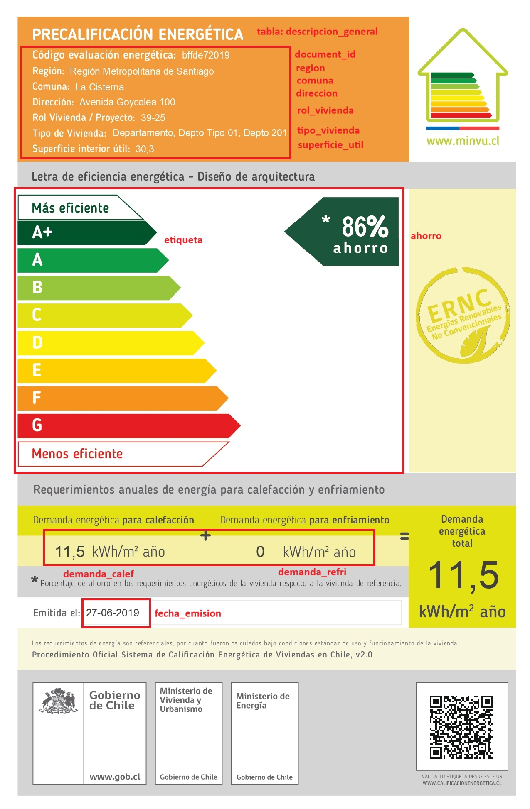
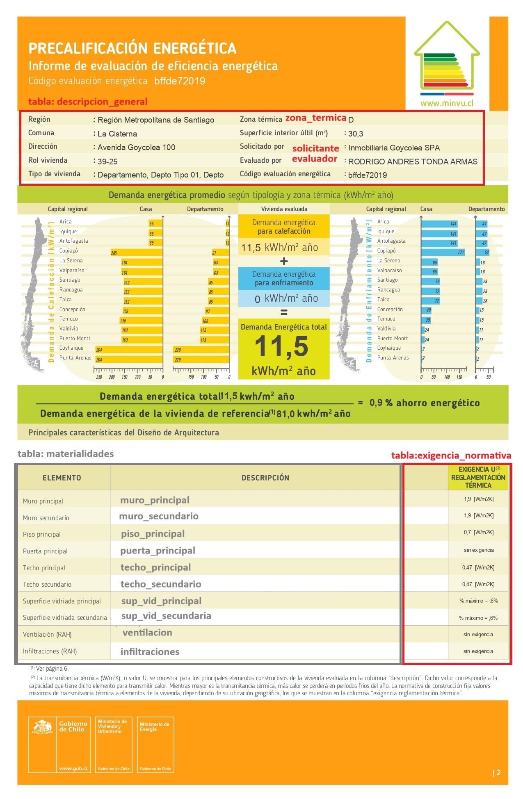
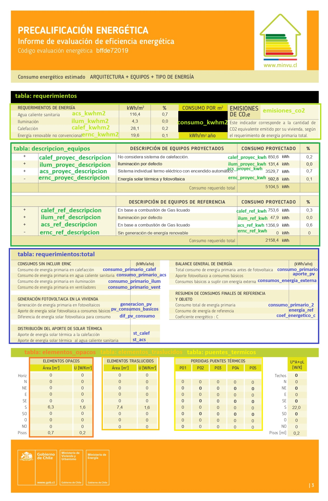
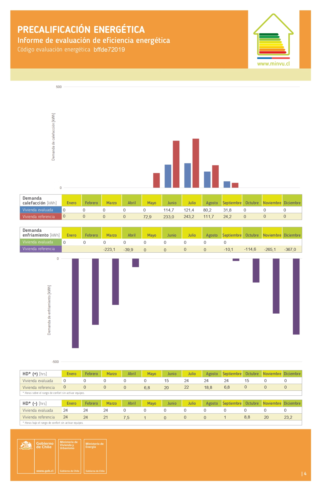
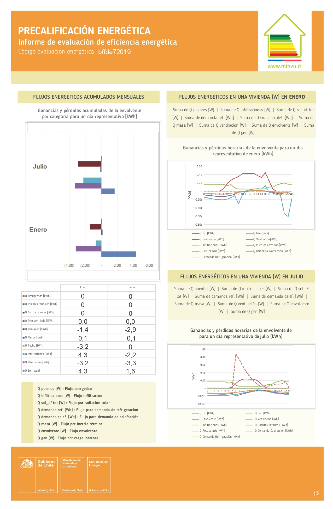
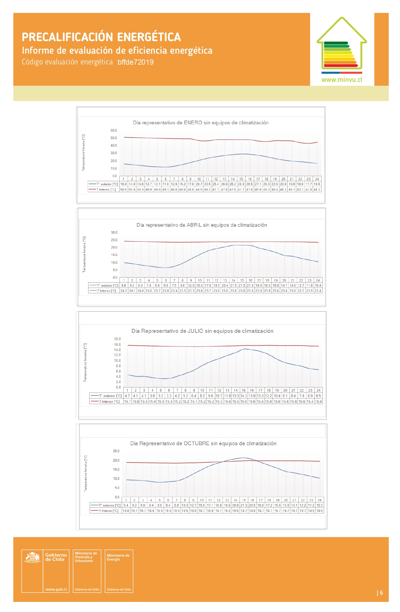
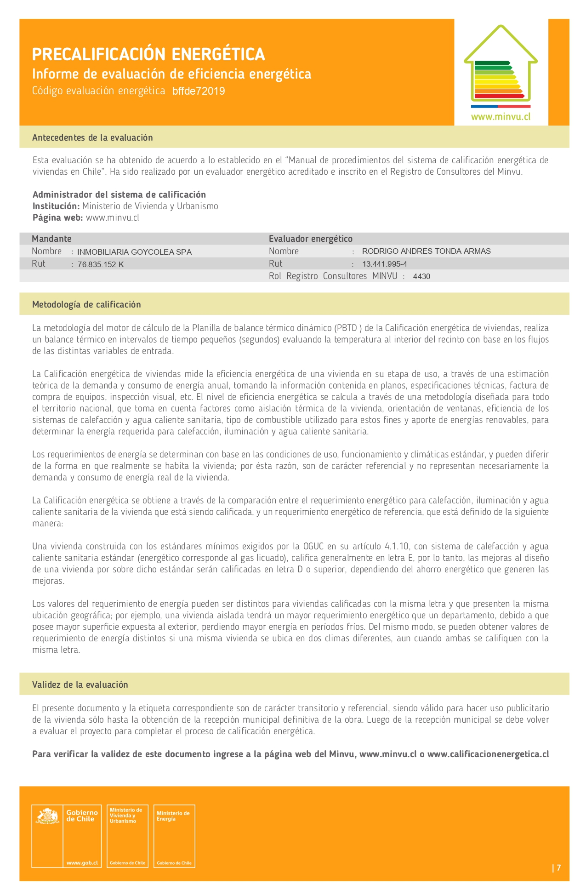

# Guia de procesamiento de PDFs y generacion de SQLite

Esta guia explica como se procesan las fichas PDF CEV, como se usan las regiones de extraccion y como se genera la base SQLite consolidada.

## Insumos

El procesamiento usa tres insumos principales:

- PDFs descargados en `cev_pdf_dir`.
- Regiones de extraccion en `pdf_regions_path`, actualmente `config/table_regions.json`.
- Rutas de salida definidas en `config/paths.yaml`, especialmente `pdf_extract_out_dir` y `cev_db_path`.

Las imagenes siguientes son la ficha de referencia exportada a JPG. Sirven para documentar visualmente que informacion aparece en cada pagina y sobre que estructura se marcaron las regiones.















## Marcado de regiones

El archivo `config/table_regions.json` fue generado con `scripts/pdf_coord_picker_multipage.py`. Ese script abre un PDF de referencia y permite dibujar rectangulos por pagina. Cada rectangulo queda guardado con coordenadas PDF y un identificador como `page_01_region_01`.

Para revisar o regenerar las regiones:

```bash
python scripts/pdf_coord_picker_multipage.py \
  --pdf ruta/a/ficha_referencia.pdf
```

Por defecto el JSON se guarda en la ruta `pdf_regions_path` definida en `config/paths.yaml`. Tambien puedes indicar una salida explicita:

```bash
python scripts/pdf_coord_picker_multipage.py \
  --pdf ruta/a/ficha_referencia.pdf \
  --out config/table_regions.json
```

## Extraccion y compilacion

El script principal de procesamiento es `scripts/extract_visible_rows_and_build_db.py`:

```bash
python scripts/extract_visible_rows_and_build_db.py --recursive
```

Si no pasas rutas, el script toma desde `config/paths.yaml`:

- `cev_pdf_dir` como carpeta de entrada.
- `pdf_regions_path` como configuracion de regiones.
- `pdf_extract_out_dir` como carpeta de salida intermedia.
- `cev_db_path` como base SQLite final.

Para una ejecucion manual con rutas explicitas:

```bash
python scripts/extract_visible_rows_and_build_db.py \
  --input-dir data/raw/cev_fichas \
  --recursive \
  --regions config/table_regions.json \
  --out-dir data/interim/output_cev_compiled \
  --db data/processed/cev_compiled.sqlite
```

## Procesamiento supervisado por lotes

Para lotes grandes conviene usar `scripts/run_cev_supervised.py`, que llama al extractor PDF por PDF y registra fallos sin detener todo el proceso:

```bash
python scripts/run_cev_supervised.py \
  --folder-mtime-before "2026-05-11 17:00:00" \
  --progress-every 100
```

Este runner tambien usa `config/paths.yaml` por defecto. El log de fallos se escribe en `failed_processing_log_path`.

## Como se construye la base SQLite

El extractor abre cada PDF con PyMuPDF, valida que tenga 7 paginas y recorre las regiones definidas en `table_regions.json`. Para cada region obtiene texto visible, limpia valores numericos y arma registros estructurados.

La base se inicializa con tablas tematicas:

- `descripcion_general`: identificacion del documento, region, comuna, direccion, tipo de vivienda, superficie, etiqueta y datos generales.
- `requerimientos`: consumos por ACS, iluminacion, calefaccion, ERNC, consumo total y emisiones.
- `descripcion_equipos`: descripcion y consumo de equipos de proyecto y referencia.
- `requerimientos_total`: consumos primarios, aportes fotovoltaicos, solar termico y coeficiente energetico.
- `elementos_opacos`: areas y transmitancias por orientacion.
- `elementos_traslucidos`: ventanas u otros elementos traslucidos por orientacion.
- `puentes_termicos`: valores por orientacion y tipo de puente termico.
- `materialidades`: descripcion de materialidades por elemento constructivo.
- `exigencia_u_normativa`: exigencias normativas de transmitancia por elemento.

Cada tabla usa `document_id` como llave principal o como parte de una llave compuesta. El script usa `INSERT OR REPLACE`, por lo que volver a procesar un PDF actualiza sus registros en la base.

## Salidas

Las salidas principales son:

```text
pdf_extract_out_dir/
  *_visible_rows.csv        # archivos auxiliares por region, si se generan durante depuracion
cev_db_path                 # base SQLite consolidada
failed_processing_log_path  # errores por PDF cuando se usa run_cev_supervised.py
```

La base SQLite no se versiona en Git porque puede crecer rapidamente. Para compartir resultados, conviene exportar tablas o consultas puntuales a `reports/` o `data/processed/` segun el peso del archivo.
