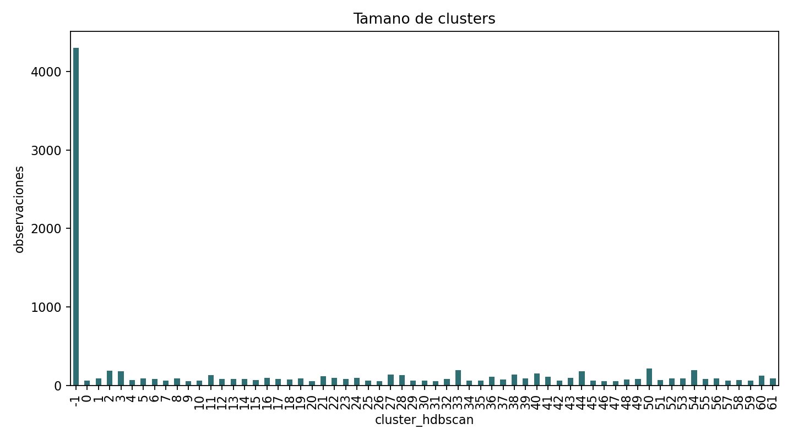
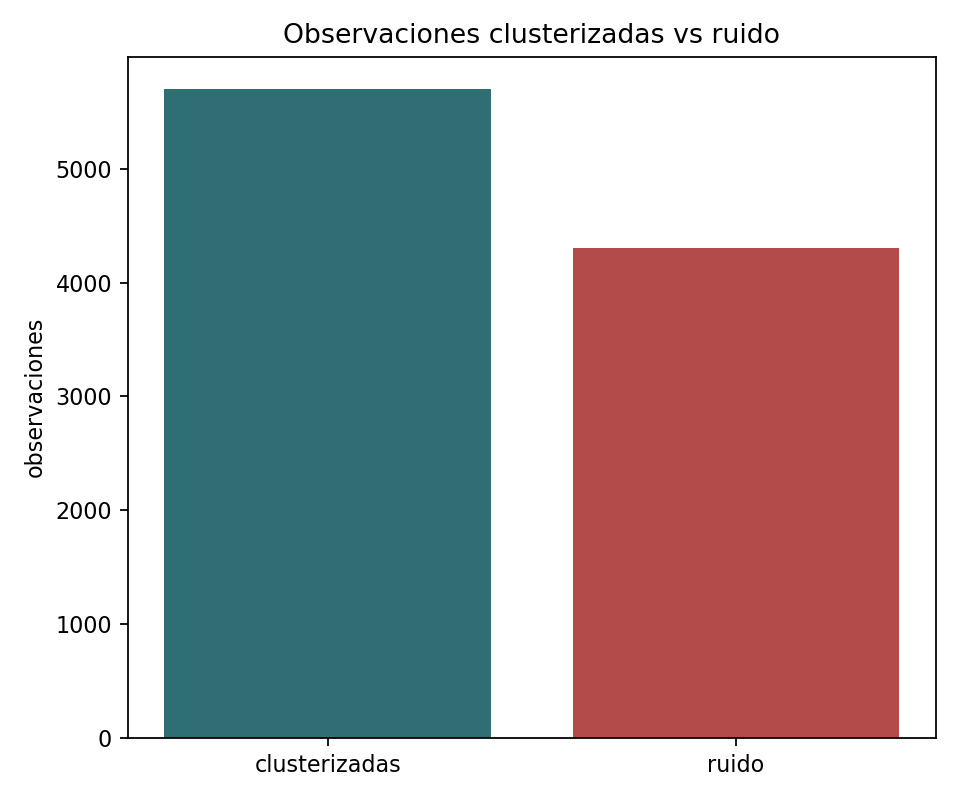
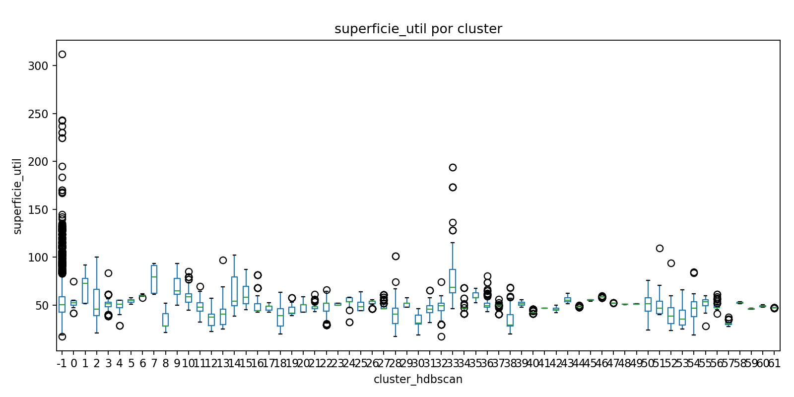
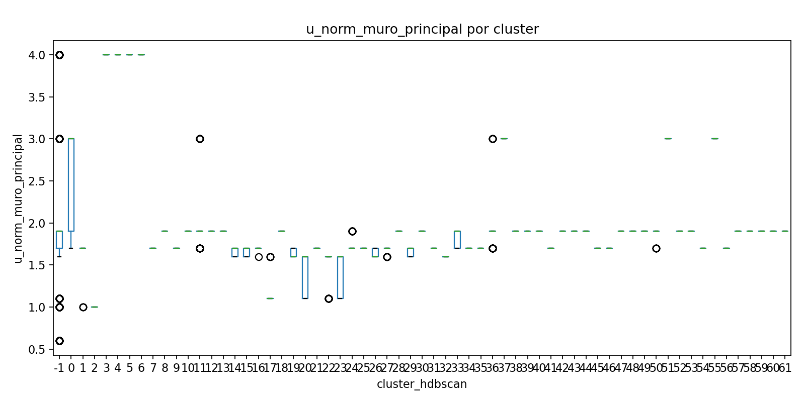
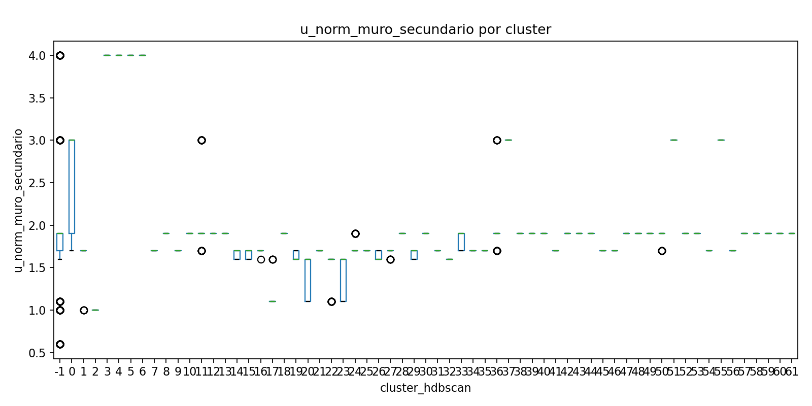
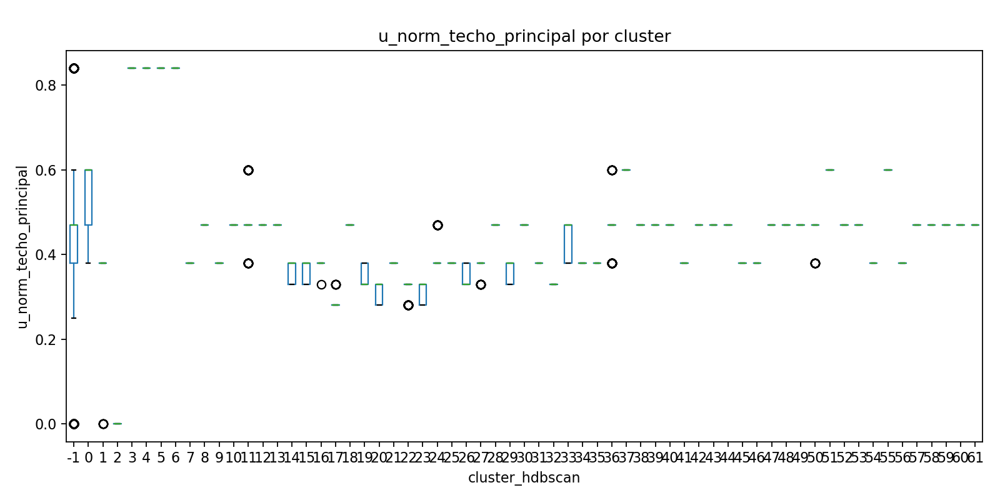
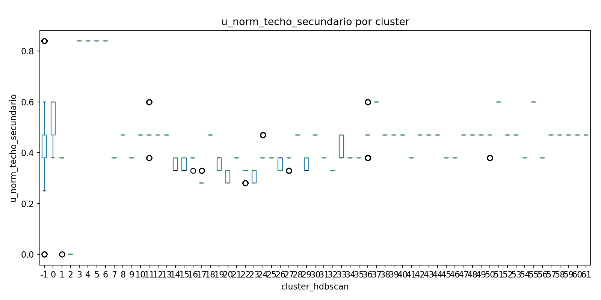
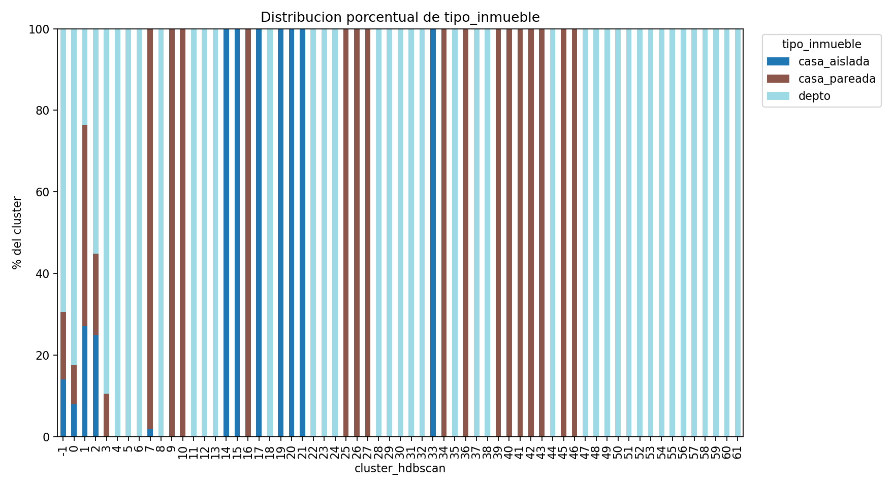
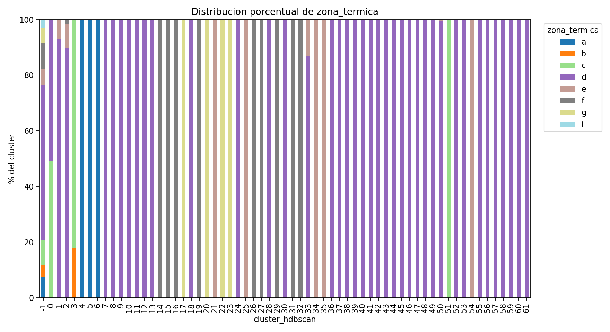
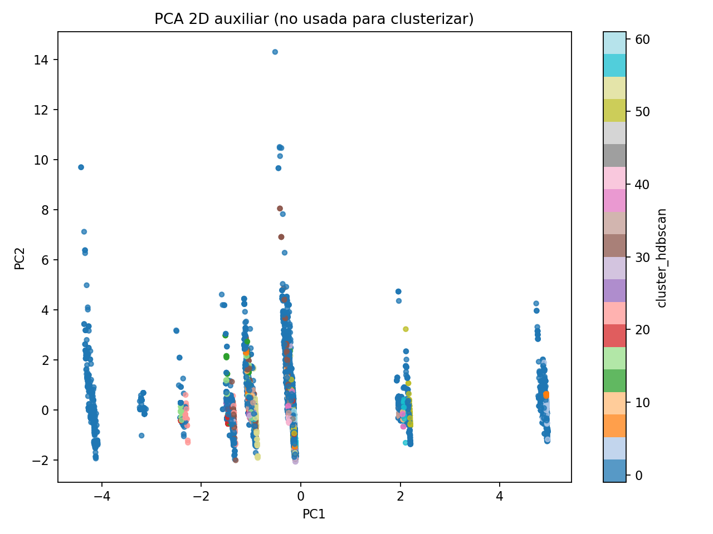

# Reporte de clusterización de fichas CEV para definición de arquetipos habitacionales

> **Reporte histórico/deprecado:** esta corrida usó las descripciones textuales de calefacción y ACS como variables categóricas. Se archivó porque el texto libre de equipamientos generó muchas categorías equivalentes o casi equivalentes, fragmentó los clusters y elevó el ruido de HDBSCAN. El reporte principal actual usa `calef_proyec_kwh` y `acs_proyec_kwh` como variables numéricas con `log1p`.

## Resumen ejecutivo

- Registros analizados: 228973
- Registros usados finalmente: 10000
- Clusters encontrados (sin ruido): 62
- Ruido: 4300 (43.00%)
- Se trabajo con 10000 fichas sobre 228973 registros disponibles; si se uso `--max-rows`, la muestra es reproducible.
- Los arquetipos y sus etiquetas son preliminares; requieren revision tecnica antes de usarse como verdad operacional.

### Principales hallazgos

- HDBSCAN identifico 62 clusters no ruido y dejo 4300 observaciones como ruido (43.00%).
- Los clusters son de tamano minimo 50, mediano 82.0 y maximo 217.
- El cluster no ruido mas grande es 50, con 217 fichas (2.17% del total) y etiqueta preliminar: depto | d | sup_mediana 52 m2 | calef: no posee | acs: calefont.
- Tipos de inmueble dominantes entre clusters: depto, casa_pareada, casa_aislada.
- Zonas termicas dominantes entre clusters: d, f, e.
- Sistemas dominantes: calefaccion no posee, calefactor electrico, estufa kerosene 3 kw; ACS calefont 7 litros tiro forzado, calefont glp, calefont.
- Las pruebas estadisticas son exploratorias; ayudan a detectar diferencias entre grupos, pero no reemplazan la revision tecnica de los arquetipos.

## Metodologia

Se usaron variables mixtas de superficie, zona termica, tipo de inmueble, sistemas proyectados y exigencias U normativas. La distancia de Gower permite comparar variables numericas y categoricas en una misma matriz de similitud. HDBSCAN se aplico con `metric="precomputed"` porque no exige fijar previamente la cantidad de clusters y permite clasificar observaciones como ruido (`-1`). Los datos faltantes se imputaron con mediana en variables numericas y `desconocido` en categoricas. La matriz de Gower escala aproximadamente como `n x n`, por lo que puede ser costosa para bases grandes.

- Parametros: `min_cluster_size=50`, `min_samples=15`, `use_log_superficie=False`
- Visualizacion PCA 2D: auxiliar para inspeccion, no usada para clusterizar.

## Variables consideradas

| variable                | tipo       | tratamiento                        | % faltante antes   | imputacion   |
|-------------------------|------------|------------------------------------|--------------------|--------------|
| superficie_util         | numerica   | limpieza numerica + mediana        | 0,00%              | mediana      |
| u_norm_muro_principal   | numerica   | limpieza numerica + mediana        | 0,17%              | mediana      |
| u_norm_muro_secundario  | numerica   | limpieza numerica + mediana        | 0,17%              | mediana      |
| u_norm_techo_principal  | numerica   | limpieza numerica + mediana        | 0,17%              | mediana      |
| u_norm_techo_secundario | numerica   | limpieza numerica + mediana        | 0,17%              | mediana      |
| zona_termica            | categorica | normalizacion string + desconocido | 0,00%              | desconocido  |
| tipo_inmueble           | categorica | normalizacion string + desconocido | 0,24%              | desconocido  |
| calef_proyec            | categorica | normalizacion string + desconocido | 0,13%              | desconocido  |
| acs_proyec              | categorica | normalizacion string + desconocido | 0,08%              | desconocido  |

## Metricas de clustering

- Numero de clusters: 62
- Porcentaje de ruido: 43.00%
- Silhouette precomputado sin ruido: 0.738419983485559
- Tamano de clusters: minimo=50, mediano=82.0, maximo=217

El silhouette global reportado es el promedio de los silhouette individuales de las observaciones no ruido. Valores cercanos a 1 indican observaciones bien separadas de otros clusters; valores cercanos a 0 indican fronteras difusas; valores negativos sugieren observaciones mas parecidas a otro cluster. La tabla siguiente muestra el promedio por cluster para ayudar a detectar grupos mas o menos compactos.

|   cluster_hdbscan |   n |   silhouette_media |   silhouette_mediana |   silhouette_min |   silhouette_p25 |   silhouette_p75 |   silhouette_max |   pct_silhouette_negativo |
|-------------------|-----|--------------------|----------------------|------------------|------------------|------------------|------------------|---------------------------|
|                 0 |  63 |           0.127617 |             0.178636 |      -0.282418   |        0.0338457 |         0.266438 |         0.269872 |                  17.4603  |
|                 1 |  85 |           0.563065 |             0.616218 |       0.215442   |        0.518896  |         0.644867 |         0.655387 |                   0       |
|                 2 | 185 |           0.118286 |             0.218432 |      -0.509429   |       -0.0518053 |         0.318639 |         0.339539 |                  27.027   |
|                 3 | 181 |           0.565584 |             0.705486 |       0.0519709  |        0.459348  |         0.706812 |         0.708908 |                   0       |
|                 4 |  66 |           0.458517 |             0.556681 |       0.00285773 |        0.35488   |         0.559187 |         0.56333  |                   0       |
|                 5 |  87 |           0.622955 |             0.685761 |      -0.255392   |        0.680722  |         0.739658 |         0.756635 |                   3.44828 |
|                 6 |  79 |           0.868959 |             0.866899 |       0.237077   |        0.849137  |         0.908406 |         0.908406 |                   0       |
|                 7 |  57 |           0.919567 |             0.935342 |       0.0355166  |        0.928534  |         0.938775 |         0.943164 |                   0       |
|                 8 |  85 |           0.420848 |             0.583289 |      -0.0329671  |        0.225854  |         0.590735 |         0.5915   |                   1.17647 |
|                 9 |  52 |           0.879212 |             0.882101 |       0.799908   |        0.881875  |         0.905033 |         0.907865 |                   0       |
|                10 |  58 |           0.902053 |             0.920614 |       0.783319   |        0.882984  |         0.929756 |         0.932434 |                   0       |
|                11 | 129 |           0.503928 |             0.698214 |      -0.192213   |        0.122332  |         0.699751 |         0.702919 |                   6.20155 |
|                12 |  83 |           0.9672   |             0.969494 |       0.931531   |        0.963546  |         0.97484  |         0.975613 |                   0       |
|                13 |  78 |           0.840284 |             0.897614 |       0.0171716  |        0.890307  |         0.908064 |         0.909068 |                   0       |
|                14 |  82 |           0.856499 |             0.874641 |       0.788484   |        0.819153  |         0.883281 |         0.886461 |                   0       |
|                15 |  68 |           0.893237 |             0.91612  |       0.818836   |        0.845552  |         0.919766 |         0.924202 |                   0       |
|                16 |  92 |           0.964536 |             0.972887 |       0.8035     |        0.971297  |         0.976361 |         0.976361 |                   0       |
|                17 |  80 |           0.459769 |             0.503843 |       0.114122   |        0.503843  |         0.538491 |         0.54304  |                   0       |
|                18 |  73 |           0.93412  |             0.949619 |      -0.0329164  |        0.943705  |         0.957354 |         0.958601 |                   1.36986 |
|                19 |  87 |           0.919584 |             0.943304 |       0.8284     |        0.853726  |         0.947361 |         0.947534 |                   0       |

|   cluster_hdbscan |    n |   pct_total |   superficie_util_mediana |   superficie_util_media |   superficie_util_p25 |   superficie_util_p75 |   u_norm_muro_principal_mediana |   u_norm_muro_principal_media |   u_norm_muro_principal_p25 |   u_norm_muro_principal_p75 |   u_norm_muro_secundario_mediana |   u_norm_muro_secundario_media |   u_norm_muro_secundario_p25 |   u_norm_muro_secundario_p75 |   u_norm_techo_principal_mediana |   u_norm_techo_principal_media |   u_norm_techo_principal_p25 |   u_norm_techo_principal_p75 |   u_norm_techo_secundario_mediana |   u_norm_techo_secundario_media |   u_norm_techo_secundario_p25 |   u_norm_techo_secundario_p75 | zona_termica_moda   |   zona_termica_pct_moda | tipo_inmueble_moda   |   tipo_inmueble_pct_moda | calef_proyec_moda    |   calef_proyec_pct_moda | acs_proyec_moda                                            |   acs_proyec_pct_moda | etiqueta_arquetipo_preliminar                                                                                     |
|-------------------|------|-------------|---------------------------|-------------------------|-----------------------|-----------------------|---------------------------------|-------------------------------|-----------------------------|-----------------------------|----------------------------------|--------------------------------|------------------------------|------------------------------|----------------------------------|--------------------------------|------------------------------|------------------------------|-----------------------------------|---------------------------------|-------------------------------|-------------------------------|---------------------|-------------------------|----------------------|--------------------------|----------------------|-------------------------|------------------------------------------------------------|-----------------------|-------------------------------------------------------------------------------------------------------------------|
|                -1 | 4300 |       43    |                      50.5 |                 54.2363 |                42.7   |                58.825 |                             1.9 |                       2.18247 |                         1.7 |                         1.9 |                              1.9 |                        2.18247 |                          1.7 |                          1.9 |                             0.47 |                       0.48004  |                         0.38 |                         0.47 |                              0.47 |                        0.48004  |                          0.38 |                          0.47 | d                   |                 55.7674 | depto                |                  69.1163 | no posee             |                 64.9302 | calefont 7 litros tiro forzado                             |               11.093  | ruido / observacion atipica                                                                                       |
|                 0 |   63 |        0.63 |                      52.5 |                 52.2063 |                50.1   |                54.4   |                             3   |                       2.60317 |                         1.9 |                         3   |                              3   |                        2.60317 |                          1.9 |                          3   |                             0.6  |                       0.548889 |                         0.47 |                         0.6  |                              0.6  |                        0.548889 |                          0.47 |                          0.6  | d                   |                 50.7937 | depto                |                  82.5397 | calefactor electrico |                100      | calefont 10 litros gl                                      |               58.7302 | depto | d | sup_mediana 52 m2 | calef: calefactor electrico | acs: calefont 10 litros gl                          |
|                 1 |   85 |        0.85 |                      72.6 |                 67.0129 |                52.2   |                77.8   |                             1.7 |                       1.65882 |                         1.7 |                         1.7 |                              1.7 |                        1.65882 |                          1.7 |                          1.7 |                             0.38 |                       0.357647 |                         0.38 |                         0.38 |                              0.38 |                        0.357647 |                          0.38 |                          0.38 | d                   |                 92.9412 | casa_pareada         |                  49.4118 | estufa kerosene 3 kw |                100      | calefon tiro natural 10 lts +sst                           |              100      | casa_pareada | d | sup_mediana 73 m2 | calef: estufa kerosene 3 kw | acs: calefon tiro natural 10 lts +sst        |
|                 2 |  185 |        1.85 |                      45.7 |                 52.1503 |                38.9   |                66.8   |                             1   |                       1       |                         1   |                         1   |                              1   |                        1       |                          1   |                          1   |                             0    |                       0        |                         0    |                         0    |                              0    |                        0        |                          0    |                          0    | d                   |                 89.7297 | depto                |                  55.1351 | no posee             |                100      | calefont 7 litros tiro forzado                             |               35.1351 | depto | d | sup_mediana 46 m2 | calef: no posee | acs: calefont 7 litros tiro forzado                             |
|                 3 |  181 |        1.81 |                      51.5 |                 50.7044 |                48.3   |                53     |                             4   |                       4       |                         4   |                         4   |                              4   |                        4       |                          4   |                          4   |                             0.84 |                       0.84     |                         0.84 |                         0.84 |                              0.84 |                        0.84     |                          0.84 |                          0.84 | c                   |                 82.3204 | depto                |                  89.5028 | no posee             |                100      | calefont 7 litros tiro forzado                             |              100      | depto | c | sup_mediana 52 m2 | calef: no posee | acs: calefont 7 litros tiro forzado                             |
|                 4 |   66 |        0.66 |                      50.8 |                 50.3485 |                47.5   |                55.075 |                             4   |                       4       |                         4   |                         4   |                              4   |                        4       |                          4   |                          4   |                             0.84 |                       0.84     |                         0.84 |                         0.84 |                              0.84 |                        0.84     |                          0.84 |                          0.84 | a                   |                100      | depto                |                 100      | no posee             |                100      | calefon splendid mvg tfi de 10 litros, de 17,6 kw potencia |               57.5758 | depto | a | sup_mediana 51 m2 | calef: no posee | acs: calefon splendid mvg tfi de 10 litros, de 17,6 kw potencia |
|                 5 |   87 |        0.87 |                      55   |                 54.6391 |                53.1   |                55.6   |                             4   |                       4       |                         4   |                         4   |                              4   |                        4       |                          4   |                          4   |                             0.84 |                       0.84     |                         0.84 |                         0.84 |                              0.84 |                        0.84     |                          0.84 |                          0.84 | a                   |                100      | depto                |                 100      | no posee             |                100      | calefont 7 litros tiro forzado                             |              100      | depto | a | sup_mediana 55 m2 | calef: no posee | acs: calefont 7 litros tiro forzado                             |
|                 6 |   79 |        0.79 |                      60   |                 60.181  |                59.6   |                60.5   |                             4   |                       4       |                         4   |                         4   |                              4   |                        4       |                          4   |                          4   |                             0.84 |                       0.84     |                         0.84 |                         0.84 |                              0.84 |                        0.84     |                          0.84 |                          0.84 | a                   |                100      | depto                |                 100      | no posee             |                100      | calefont 7 litros tiro forzado                             |              100      | depto | a | sup_mediana 60 m2 | calef: no posee | acs: calefont 7 litros tiro forzado                             |
|                 7 |   57 |        0.57 |                      79.4 |                 78.2105 |                62.5   |                91.6   |                             1.7 |                       1.7     |                         1.7 |                         1.7 |                              1.7 |                        1.7     |                          1.7 |                          1.7 |                             0.38 |                       0.38     |                         0.38 |                         0.38 |                              0.38 |                        0.38     |                          0.38 |                          0.38 | d                   |                100      | casa_pareada         |                  98.2456 | no posee             |                100      | calefont tiro forzado                                      |              100      | casa_pareada | d | sup_mediana 79 m2 | calef: no posee | acs: calefont tiro forzado                               |
|                 8 |   85 |        0.85 |                      28.4 |                 32.3788 |                28.1   |                41.2   |                             1.9 |                       1.9     |                         1.9 |                         1.9 |                              1.9 |                        1.9     |                          1.9 |                          1.9 |                             0.47 |                       0.47     |                         0.47 |                         0.47 |                              0.47 |                        0.47     |                          0.47 |                          0.47 | d                   |                100      | depto                |                 100      | no posee             |                100      | termo eléctrico                                            |               61.1765 | depto | d | sup_mediana 28 m2 | calef: no posee | acs: termo eléctrico                                            |
|                 9 |   52 |        0.52 |                      64.8 |                 67.6673 |                61.3   |                78.2   |                             1.7 |                       1.7     |                         1.7 |                         1.7 |                              1.7 |                        1.7     |                          1.7 |                          1.7 |                             0.38 |                       0.38     |                         0.38 |                         0.38 |                              0.38 |                        0.38     |                          0.38 |                          0.38 | d                   |                100      | casa_pareada         |                 100      | no posee             |                100      | calefont                                                   |              100      | casa_pareada | d | sup_mediana 65 m2 | calef: no posee | acs: calefont                                            |
|                10 |   58 |        0.58 |                      58.6 |                 60.1276 |                53.275 |                62     |                             1.9 |                       1.9     |                         1.9 |                         1.9 |                              1.9 |                        1.9     |                          1.9 |                          1.9 |                             0.47 |                       0.47     |                         0.47 |                         0.47 |                              0.47 |                        0.47     |                          0.47 |                          0.47 | d                   |                100      | casa_pareada         |                 100      | no posee             |                100      | calefont                                                   |              100      | casa_pareada | d | sup_mediana 59 m2 | calef: no posee | acs: calefont                                            |
|                11 |  129 |        1.29 |                      48   |                 48.145  |                43.9   |                52.4   |                             1.9 |                       2.09302 |                         1.9 |                         1.9 |                              1.9 |                        2.09302 |                          1.9 |                          1.9 |                             0.47 |                       0.486124 |                         0.47 |                         0.47 |                              0.47 |                        0.486124 |                          0.47 |                          0.47 | d                   |                100      | depto                |                 100      | no posee             |                100      | calefont 10 litros tiro forzado                            |               93.7984 | depto | d | sup_mediana 48 m2 | calef: no posee | acs: calefont 10 litros tiro forzado                            |
|                12 |   83 |        0.83 |                      37.6 |                 37.1313 |                28.9   |                40.6   |                             1.9 |                       1.9     |                         1.9 |                         1.9 |                              1.9 |                        1.9     |                          1.9 |                          1.9 |                             0.47 |                       0.47     |                         0.47 |                         0.47 |                              0.47 |                        0.47     |                          0.47 |                          0.47 | d                   |                100      | depto                |                 100      | no posee             |                100      | sala de calderas                                           |              100      | depto | d | sup_mediana 38 m2 | calef: no posee | acs: sala de calderas                                           |
|                13 |   78 |        0.78 |                      40.8 |                 40.0115 |                29.525 |                45.6   |                             1.9 |                       1.9     |                         1.9 |                         1.9 |                              1.9 |                        1.9     |                          1.9 |                          1.9 |                             0.47 |                       0.47     |                         0.47 |                         0.47 |                              0.47 |                        0.47     |                          0.47 |                          0.47 | d                   |                100      | depto                |                 100      | no posee             |                100      | caldera condensación                                       |               93.5897 | depto | d | sup_mediana 41 m2 | calef: no posee | acs: caldera condensación                                       |
|                14 |   82 |        0.82 |                      54.1 |                 63.5268 |                49.5   |                79.425 |                             1.7 |                       1.66585 |                         1.6 |                         1.7 |                              1.7 |                        1.66585 |                          1.6 |                          1.7 |                             0.38 |                       0.362927 |                         0.33 |                         0.38 |                              0.38 |                        0.362927 |                          0.33 |                          0.38 | f                   |                100      | casa_aislada         |                 100      | no posee             |                100      | calefont 7 litros tiro forzado                             |              100      | casa_aislada | f | sup_mediana 54 m2 | calef: no posee | acs: calefont 7 litros tiro forzado                      |
|                15 |   68 |        0.68 |                      58.3 |                 62.5353 |                51.3   |                69.8   |                             1.7 |                       1.67353 |                         1.6 |                         1.7 |                              1.7 |                        1.67353 |                          1.6 |                          1.7 |                             0.38 |                       0.366765 |                         0.33 |                         0.38 |                              0.38 |                        0.366765 |                          0.33 |                          0.38 | f                   |                100      | casa_aislada         |                 100      | no posee             |                100      | calefont 10 litros tiro forzado                            |              100      | casa_aislada | f | sup_mediana 58 m2 | calef: no posee | acs: calefont 10 litros tiro forzado                     |
|                16 |   92 |        0.92 |                      44.5 |                 50.1511 |                44.375 |                51.6   |                             1.7 |                       1.69891 |                         1.7 |                         1.7 |                              1.7 |                        1.69891 |                          1.7 |                          1.7 |                             0.38 |                       0.379457 |                         0.38 |                         0.38 |                              0.38 |                        0.379457 |                          0.38 |                          0.38 | f                   |                100      | casa_pareada         |                 100      | no posee             |                100      | calefont 7 litros tiro forzado                             |              100      | casa_pareada | f | sup_mediana 44 m2 | calef: no posee | acs: calefont 7 litros tiro forzado                      |
|                17 |   80 |        0.8  |                      48.7 |                 47.4237 |                44.8   |                48.7   |                             1.1 |                       1.13125 |                         1.1 |                         1.1 |                              1.1 |                        1.13125 |                          1.1 |                          1.1 |                             0.28 |                       0.283125 |                         0.28 |                         0.28 |                              0.28 |                        0.283125 |                          0.28 |                          0.28 | g                   |                100      | casa_aislada         |                 100      | no posee             |                100      | calefont 7 litros                                          |               45      | casa_aislada | g | sup_mediana 49 m2 | calef: no posee | acs: calefont 7 litros                                   |
|                18 |   73 |        0.73 |                      39   |                 38.6096 |                28.4   |                46.2   |                             1.9 |                       1.9     |                         1.9 |                         1.9 |                              1.9 |                        1.9     |                          1.9 |                          1.9 |                             0.47 |                       0.47     |                         0.47 |                         0.47 |                              0.47 |                        0.47     |                          0.47 |                          0.47 | d                   |                100      | depto                |                 100      | no posee             |                100      | caldera a condensación                                     |               98.6301 | depto | d | sup_mediana 39 m2 | calef: no posee | acs: caldera a condensación                                     |

## Visualizaciones

### Como leer el PCA 2D

El PCA 2D es una proyeccion auxiliar construida con variables numericas escaladas y categoricas codificadas con one-hot. No fue usado para clusterizar; solo sirve como mapa visual aproximado de similitudes. Puntos cercanos en el grafico tienden a compartir combinaciones parecidas de variables, y colores separados sugieren clusters visualmente distinguibles. Si dos colores se superponen, no significa necesariamente que HDBSCAN este mal: la proyeccion reduce muchas dimensiones a dos y puede esconder separaciones que existen en el espacio original de Gower.

## Analisis estadistico

Los estadisticos y pruebas Kruskal-Wallis o chi-cuadrado son exploratorios, no concluyentes, y no definen por si solos la validez tecnica de un cluster.

### Estadisticos globales numericos

| variable                |   count |     media |   mediana |   desviacion_estandar |   minimo |   p25 |    p75 |   maximo |   coeficiente_variacion |
|-------------------------|---------|-----------|-----------|-----------------------|----------|-------|--------|----------|-------------------------|
| superficie_util         |   10000 | 51.7759   |     49.6  |             17.4882   |     17.3 | 43.7  | 55.725 |   312.1  |                0.337768 |
| u_norm_muro_principal   |    9983 |  2.06705  |      1.9  |              0.76572  |      0.6 |  1.7  |  1.9   |     4    |                0.37044  |
| u_norm_muro_secundario  |    9983 |  2.06705  |      1.9  |              0.76572  |      0.6 |  1.7  |  1.9   |     4    |                0.37044  |
| u_norm_techo_principal  |    9983 |  0.461332 |      0.47 |              0.163589 |      0   |  0.38 |  0.47  |     0.84 |                0.354601 |
| u_norm_techo_secundario |    9983 |  0.461332 |      0.47 |              0.163589 |      0   |  0.38 |  0.47  |     0.84 |                0.354601 |

### Estadisticos por cluster

|   cluster_hdbscan | variable                |   count |     media |   mediana |   desviacion_estandar |   minimo |   p25 |    p75 |   maximo |   coeficiente_variacion |
|-------------------|-------------------------|---------|-----------|-----------|-----------------------|----------|-------|--------|----------|-------------------------|
|                -1 | superficie_util         |    4300 | 54.2363   |     50.5  |            21.695     |    17.4  | 42.7  | 58.825 |   312.1  |               0.400009  |
|                -1 | u_norm_muro_principal   |    4283 |  2.18247  |      1.9  |             0.871184  |     0.6  |  1.7  |  1.9   |     4    |               0.399174  |
|                -1 | u_norm_muro_secundario  |    4283 |  2.18247  |      1.9  |             0.871184  |     0.6  |  1.7  |  1.9   |     4    |               0.399174  |
|                -1 | u_norm_techo_principal  |    4283 |  0.48004  |      0.47 |             0.178952  |     0    |  0.38 |  0.47  |     0.84 |               0.372786  |
|                -1 | u_norm_techo_secundario |    4283 |  0.48004  |      0.47 |             0.178952  |     0    |  0.38 |  0.47  |     0.84 |               0.372786  |
|                 0 | superficie_util         |      63 | 52.2063   |     52.5  |             4.17303   |    41.7  | 50.1  | 54.4   |    74.9  |               0.0799333 |
|                 0 | u_norm_muro_principal   |      63 |  2.60317  |      3    |             0.548008  |     1.7  |  1.9  |  3     |     3    |               0.210515  |
|                 0 | u_norm_muro_secundario  |      63 |  2.60317  |      3    |             0.548008  |     1.7  |  1.9  |  3     |     3    |               0.210515  |
|                 0 | u_norm_techo_principal  |      63 |  0.548889 |      0.6  |             0.0733113 |     0.38 |  0.47 |  0.6   |     0.6  |               0.133563  |
|                 0 | u_norm_techo_secundario |      63 |  0.548889 |      0.6  |             0.0733113 |     0.38 |  0.47 |  0.6   |     0.6  |               0.133563  |
|                 1 | superficie_util         |      85 | 67.0129   |     72.6  |            13.2789    |    51.6  | 52.2  | 77.8   |    91.7  |               0.198155  |
|                 1 | u_norm_muro_principal   |      85 |  1.65882  |      1.7  |             0.165683  |     1    |  1.7  |  1.7   |     1.7  |               0.09988   |
|                 1 | u_norm_muro_secundario  |      85 |  1.65882  |      1.7  |             0.165683  |     1    |  1.7  |  1.7   |     1.7  |               0.09988   |
|                 1 | u_norm_techo_principal  |      85 |  0.357647 |      0.38 |             0.0899424 |     0    |  0.38 |  0.38  |     0.38 |               0.251484  |
|                 1 | u_norm_techo_secundario |      85 |  0.357647 |      0.38 |             0.0899424 |     0    |  0.38 |  0.38  |     0.38 |               0.251484  |
|                 2 | superficie_util         |     185 | 52.1503   |     45.7  |            19.7989    |    20.8  | 38.9  | 66.8   |   100.3  |               0.379651  |
|                 2 | u_norm_muro_principal   |     185 |  1        |      1    |             0         |     1    |  1    |  1     |     1    |               0         |
|                 2 | u_norm_muro_secundario  |     185 |  1        |      1    |             0         |     1    |  1    |  1     |     1    |               0         |
|                 2 | u_norm_techo_principal  |     185 |  0        |      0    |             0         |     0    |  0    |  0     |     0    |             nan         |
|                 2 | u_norm_techo_secundario |     185 |  0        |      0    |             0         |     0    |  0    |  0     |     0    |             nan         |

### Como leer las pruebas exploratorias

Kruskal-Wallis se aplica a variables numericas y compara si las distribuciones por cluster tienden a tener rangos similares. Es una alternativa no parametrica a ANOVA: no exige normalidad y trabaja con ordenamientos/rangos. El estadistico H no esta en las unidades originales de la variable: para superficie no son m2, y para exigencias U tampoco son W/m2K. Es una medida de separacion entre rangos promedio de los clusters. No hay un umbral universal para decir alto o bajo, porque depende del tamano muestral y de los grados de libertad. Como referencia practica, se compara con una distribucion chi-cuadrado con `k - 1` grados de libertad, donde `k` es la cantidad de clusters comparados: si H es mucho mayor que esos grados de libertad y el p-value es muy pequeno, hay evidencia de diferencias entre clusters. Para interpretar magnitud, se reporta epsilon-cuadrado: valores cercanos a 0 sugieren efecto pequeno; alrededor de 0,01 pequeno, 0,06 moderado y 0,14 o mas grande, como regla orientativa.

Chi-cuadrado se aplica a variables categoricas y compara la tabla cluster x categoria contra lo que se esperaria si cluster y categoria fueran independientes. Su estadistico tampoco tiene unidades; resume cuanto se apartan las frecuencias observadas de las frecuencias esperadas bajo independencia. Tampoco hay un umbral universal: se evalua contra una distribucion chi-cuadrado con grados de libertad dados por `(filas - 1) * (columnas - 1)`. Como regla rapida, si el estadistico es mucho mayor que los grados de libertad y el p-value es pequeno, cluster y categoria no parecen independientes. Para magnitud se reporta V de Cramer, que va entre 0 y 1: cerca de 0 indica asociacion debil; alrededor de 0,1 baja, 0,3 moderada y 0,5 alta, aunque el contexto tecnico importa.

En esta corrida, p-values muy bajos sugieren que las variables analizadas efectivamente cambian entre clusters. La conclusion practica no es que los clusters sean automaticamente validos, sino que capturan diferencias observables en superficie, exigencias U, tipo de inmueble, zona termica y sistemas proyectados. Los tamanos de efecto ayudan a distinguir diferencias estadisticamente detectables de diferencias tecnicamente relevantes.

### Pruebas exploratorias

| variable                | tipo       | prueba                     |   estadistico |   p_value |   grados_libertad |   tamano_efecto | tamano_efecto_nombre   | nota                          |
|-------------------------|------------|----------------------------|---------------|-----------|-------------------|-----------------|------------------------|-------------------------------|
| superficie_util         | numerica   | Kruskal-Wallis             |       3179.45 |         0 |                61 |        0.553112 | epsilon_cuadrado       | Exploratoria, no concluyente. |
| u_norm_muro_principal   | numerica   | Kruskal-Wallis             |       5421.26 |         0 |                61 |        0.950738 | epsilon_cuadrado       | Exploratoria, no concluyente. |
| u_norm_muro_secundario  | numerica   | Kruskal-Wallis             |       5421.26 |         0 |                61 |        0.950738 | epsilon_cuadrado       | Exploratoria, no concluyente. |
| u_norm_techo_principal  | numerica   | Kruskal-Wallis             |       5421.26 |         0 |                61 |        0.950738 | epsilon_cuadrado       | Exploratoria, no concluyente. |
| u_norm_techo_secundario | numerica   | Kruskal-Wallis             |       5421.26 |         0 |                61 |        0.950738 | epsilon_cuadrado       | Exploratoria, no concluyente. |
| zona_termica            | categorica | Chi-cuadrado independencia |      27957    |         0 |               366 |        0.904133 | v_cramer               | Exploratoria, no concluyente. |
| tipo_inmueble           | categorica | Chi-cuadrado independencia |      10527.1  |         0 |               122 |        0.96095  | v_cramer               | Exploratoria, no concluyente. |
| calef_proyec            | categorica | Chi-cuadrado independencia |      25620.8  |         0 |               305 |        0.948144 | v_cramer               | Exploratoria, no concluyente. |
| acs_proyec              | categorica | Chi-cuadrado independencia |      94277.6  |         0 |              4331 |        0.520717 | v_cramer               | Exploratoria, no concluyente. |

## Perfil de arquetipos

## Arquetipo / Cluster 0

- Tamano del cluster: 63
- Porcentaje del total: 0.63%
- Etiqueta preliminar: depto | d | sup_mediana 52 m2 | calef: calefactor electrico | acs: calefont 10 litros gl
- Silhouette promedio del cluster: 0.12761697954172085
- Superficie util mediana: 52.5
- Zona termica dominante: d
- Tipo de inmueble dominante: depto
- Calefaccion proyectada dominante: calefactor electrico
- ACS proyectado dominante: calefont 10 litros gl
- Exigencia U muro principal mediana: 3.0
- Exigencia U muro secundario mediana: 3.0
- Exigencia U techo principal mediana: 0.6
- Exigencia U techo secundario mediana: 0.6
- Vivienda representativa: ver `representantes_clusters.csv` y `representantes_clusters_filas_completas.csv`.
- Interpretacion tecnica preliminar: revisar el representante, los percentiles y la distribucion categorica antes de nombrar el arquetipo final.

## Arquetipo / Cluster 1

- Tamano del cluster: 85
- Porcentaje del total: 0.85%
- Etiqueta preliminar: casa_pareada | d | sup_mediana 73 m2 | calef: estufa kerosene 3 kw | acs: calefon tiro natural 10 lts +sst
- Silhouette promedio del cluster: 0.5630647169733236
- Superficie util mediana: 72.6
- Zona termica dominante: d
- Tipo de inmueble dominante: casa_pareada
- Calefaccion proyectada dominante: estufa kerosene 3 kw
- ACS proyectado dominante: calefon tiro natural 10 lts +sst
- Exigencia U muro principal mediana: 1.7
- Exigencia U muro secundario mediana: 1.7
- Exigencia U techo principal mediana: 0.38
- Exigencia U techo secundario mediana: 0.38
- Vivienda representativa: ver `representantes_clusters.csv` y `representantes_clusters_filas_completas.csv`.
- Interpretacion tecnica preliminar: revisar el representante, los percentiles y la distribucion categorica antes de nombrar el arquetipo final.

## Arquetipo / Cluster 2

- Tamano del cluster: 185
- Porcentaje del total: 1.85%
- Etiqueta preliminar: depto | d | sup_mediana 46 m2 | calef: no posee | acs: calefont 7 litros tiro forzado
- Silhouette promedio del cluster: 0.11828630576388906
- Superficie util mediana: 45.7
- Zona termica dominante: d
- Tipo de inmueble dominante: depto
- Calefaccion proyectada dominante: no posee
- ACS proyectado dominante: calefont 7 litros tiro forzado
- Exigencia U muro principal mediana: 1.0
- Exigencia U muro secundario mediana: 1.0
- Exigencia U techo principal mediana: 0.0
- Exigencia U techo secundario mediana: 0.0
- Vivienda representativa: ver `representantes_clusters.csv` y `representantes_clusters_filas_completas.csv`.
- Interpretacion tecnica preliminar: revisar el representante, los percentiles y la distribucion categorica antes de nombrar el arquetipo final.

## Arquetipo / Cluster 3

- Tamano del cluster: 181
- Porcentaje del total: 1.81%
- Etiqueta preliminar: depto | c | sup_mediana 52 m2 | calef: no posee | acs: calefont 7 litros tiro forzado
- Silhouette promedio del cluster: 0.5655835427736121
- Superficie util mediana: 51.5
- Zona termica dominante: c
- Tipo de inmueble dominante: depto
- Calefaccion proyectada dominante: no posee
- ACS proyectado dominante: calefont 7 litros tiro forzado
- Exigencia U muro principal mediana: 4.0
- Exigencia U muro secundario mediana: 4.0
- Exigencia U techo principal mediana: 0.84
- Exigencia U techo secundario mediana: 0.84
- Vivienda representativa: ver `representantes_clusters.csv` y `representantes_clusters_filas_completas.csv`.
- Interpretacion tecnica preliminar: revisar el representante, los percentiles y la distribucion categorica antes de nombrar el arquetipo final.

## Arquetipo / Cluster 4

- Tamano del cluster: 66
- Porcentaje del total: 0.66%
- Etiqueta preliminar: depto | a | sup_mediana 51 m2 | calef: no posee | acs: calefon splendid mvg tfi de 10 litros, de 17,6 kw potencia
- Silhouette promedio del cluster: 0.4585170641609544
- Superficie util mediana: 50.8
- Zona termica dominante: a
- Tipo de inmueble dominante: depto
- Calefaccion proyectada dominante: no posee
- ACS proyectado dominante: calefon splendid mvg tfi de 10 litros, de 17,6 kw potencia
- Exigencia U muro principal mediana: 4.0
- Exigencia U muro secundario mediana: 4.0
- Exigencia U techo principal mediana: 0.84
- Exigencia U techo secundario mediana: 0.84
- Vivienda representativa: ver `representantes_clusters.csv` y `representantes_clusters_filas_completas.csv`.
- Interpretacion tecnica preliminar: revisar el representante, los percentiles y la distribucion categorica antes de nombrar el arquetipo final.

## Arquetipo / Cluster 5

- Tamano del cluster: 87
- Porcentaje del total: 0.87%
- Etiqueta preliminar: depto | a | sup_mediana 55 m2 | calef: no posee | acs: calefont 7 litros tiro forzado
- Silhouette promedio del cluster: 0.6229554616735238
- Superficie util mediana: 55.0
- Zona termica dominante: a
- Tipo de inmueble dominante: depto
- Calefaccion proyectada dominante: no posee
- ACS proyectado dominante: calefont 7 litros tiro forzado
- Exigencia U muro principal mediana: 4.0
- Exigencia U muro secundario mediana: 4.0
- Exigencia U techo principal mediana: 0.84
- Exigencia U techo secundario mediana: 0.84
- Vivienda representativa: ver `representantes_clusters.csv` y `representantes_clusters_filas_completas.csv`.
- Interpretacion tecnica preliminar: revisar el representante, los percentiles y la distribucion categorica antes de nombrar el arquetipo final.

## Arquetipo / Cluster 6

- Tamano del cluster: 79
- Porcentaje del total: 0.79%
- Etiqueta preliminar: depto | a | sup_mediana 60 m2 | calef: no posee | acs: calefont 7 litros tiro forzado
- Silhouette promedio del cluster: 0.8689585135569275
- Superficie util mediana: 60.0
- Zona termica dominante: a
- Tipo de inmueble dominante: depto
- Calefaccion proyectada dominante: no posee
- ACS proyectado dominante: calefont 7 litros tiro forzado
- Exigencia U muro principal mediana: 4.0
- Exigencia U muro secundario mediana: 4.0
- Exigencia U techo principal mediana: 0.84
- Exigencia U techo secundario mediana: 0.84
- Vivienda representativa: ver `representantes_clusters.csv` y `representantes_clusters_filas_completas.csv`.
- Interpretacion tecnica preliminar: revisar el representante, los percentiles y la distribucion categorica antes de nombrar el arquetipo final.

## Arquetipo / Cluster 7

- Tamano del cluster: 57
- Porcentaje del total: 0.57%
- Etiqueta preliminar: casa_pareada | d | sup_mediana 79 m2 | calef: no posee | acs: calefont tiro forzado
- Silhouette promedio del cluster: 0.9195667919818769
- Superficie util mediana: 79.4
- Zona termica dominante: d
- Tipo de inmueble dominante: casa_pareada
- Calefaccion proyectada dominante: no posee
- ACS proyectado dominante: calefont tiro forzado
- Exigencia U muro principal mediana: 1.7
- Exigencia U muro secundario mediana: 1.7
- Exigencia U techo principal mediana: 0.38
- Exigencia U techo secundario mediana: 0.38
- Vivienda representativa: ver `representantes_clusters.csv` y `representantes_clusters_filas_completas.csv`.
- Interpretacion tecnica preliminar: revisar el representante, los percentiles y la distribucion categorica antes de nombrar el arquetipo final.

## Arquetipo / Cluster 8

- Tamano del cluster: 85
- Porcentaje del total: 0.85%
- Etiqueta preliminar: depto | d | sup_mediana 28 m2 | calef: no posee | acs: termo eléctrico
- Silhouette promedio del cluster: 0.42084832147146695
- Superficie util mediana: 28.4
- Zona termica dominante: d
- Tipo de inmueble dominante: depto
- Calefaccion proyectada dominante: no posee
- ACS proyectado dominante: termo eléctrico
- Exigencia U muro principal mediana: 1.9
- Exigencia U muro secundario mediana: 1.9
- Exigencia U techo principal mediana: 0.47
- Exigencia U techo secundario mediana: 0.47
- Vivienda representativa: ver `representantes_clusters.csv` y `representantes_clusters_filas_completas.csv`.
- Interpretacion tecnica preliminar: revisar el representante, los percentiles y la distribucion categorica antes de nombrar el arquetipo final.

## Arquetipo / Cluster 9

- Tamano del cluster: 52
- Porcentaje del total: 0.52%
- Etiqueta preliminar: casa_pareada | d | sup_mediana 65 m2 | calef: no posee | acs: calefont
- Silhouette promedio del cluster: 0.8792116361697289
- Superficie util mediana: 64.8
- Zona termica dominante: d
- Tipo de inmueble dominante: casa_pareada
- Calefaccion proyectada dominante: no posee
- ACS proyectado dominante: calefont
- Exigencia U muro principal mediana: 1.7
- Exigencia U muro secundario mediana: 1.7
- Exigencia U techo principal mediana: 0.38
- Exigencia U techo secundario mediana: 0.38
- Vivienda representativa: ver `representantes_clusters.csv` y `representantes_clusters_filas_completas.csv`.
- Interpretacion tecnica preliminar: revisar el representante, los percentiles y la distribucion categorica antes de nombrar el arquetipo final.

## Arquetipo / Cluster 10

- Tamano del cluster: 58
- Porcentaje del total: 0.58%
- Etiqueta preliminar: casa_pareada | d | sup_mediana 59 m2 | calef: no posee | acs: calefont
- Silhouette promedio del cluster: 0.9020534237701104
- Superficie util mediana: 58.6
- Zona termica dominante: d
- Tipo de inmueble dominante: casa_pareada
- Calefaccion proyectada dominante: no posee
- ACS proyectado dominante: calefont
- Exigencia U muro principal mediana: 1.9
- Exigencia U muro secundario mediana: 1.9
- Exigencia U techo principal mediana: 0.47
- Exigencia U techo secundario mediana: 0.47
- Vivienda representativa: ver `representantes_clusters.csv` y `representantes_clusters_filas_completas.csv`.
- Interpretacion tecnica preliminar: revisar el representante, los percentiles y la distribucion categorica antes de nombrar el arquetipo final.

## Arquetipo / Cluster 11

- Tamano del cluster: 129
- Porcentaje del total: 1.29%
- Etiqueta preliminar: depto | d | sup_mediana 48 m2 | calef: no posee | acs: calefont 10 litros tiro forzado
- Silhouette promedio del cluster: 0.5039280908269743
- Superficie util mediana: 48.0
- Zona termica dominante: d
- Tipo de inmueble dominante: depto
- Calefaccion proyectada dominante: no posee
- ACS proyectado dominante: calefont 10 litros tiro forzado
- Exigencia U muro principal mediana: 1.9
- Exigencia U muro secundario mediana: 1.9
- Exigencia U techo principal mediana: 0.47
- Exigencia U techo secundario mediana: 0.47
- Vivienda representativa: ver `representantes_clusters.csv` y `representantes_clusters_filas_completas.csv`.
- Interpretacion tecnica preliminar: revisar el representante, los percentiles y la distribucion categorica antes de nombrar el arquetipo final.

## Arquetipo / Cluster 12

- Tamano del cluster: 83
- Porcentaje del total: 0.83%
- Etiqueta preliminar: depto | d | sup_mediana 38 m2 | calef: no posee | acs: sala de calderas
- Silhouette promedio del cluster: 0.9672001646603747
- Superficie util mediana: 37.6
- Zona termica dominante: d
- Tipo de inmueble dominante: depto
- Calefaccion proyectada dominante: no posee
- ACS proyectado dominante: sala de calderas
- Exigencia U muro principal mediana: 1.9
- Exigencia U muro secundario mediana: 1.9
- Exigencia U techo principal mediana: 0.47
- Exigencia U techo secundario mediana: 0.47
- Vivienda representativa: ver `representantes_clusters.csv` y `representantes_clusters_filas_completas.csv`.
- Interpretacion tecnica preliminar: revisar el representante, los percentiles y la distribucion categorica antes de nombrar el arquetipo final.

## Arquetipo / Cluster 13

- Tamano del cluster: 78
- Porcentaje del total: 0.78%
- Etiqueta preliminar: depto | d | sup_mediana 41 m2 | calef: no posee | acs: caldera condensación
- Silhouette promedio del cluster: 0.8402838519733126
- Superficie util mediana: 40.8
- Zona termica dominante: d
- Tipo de inmueble dominante: depto
- Calefaccion proyectada dominante: no posee
- ACS proyectado dominante: caldera condensación
- Exigencia U muro principal mediana: 1.9
- Exigencia U muro secundario mediana: 1.9
- Exigencia U techo principal mediana: 0.47
- Exigencia U techo secundario mediana: 0.47
- Vivienda representativa: ver `representantes_clusters.csv` y `representantes_clusters_filas_completas.csv`.
- Interpretacion tecnica preliminar: revisar el representante, los percentiles y la distribucion categorica antes de nombrar el arquetipo final.

## Arquetipo / Cluster 14

- Tamano del cluster: 82
- Porcentaje del total: 0.82%
- Etiqueta preliminar: casa_aislada | f | sup_mediana 54 m2 | calef: no posee | acs: calefont 7 litros tiro forzado
- Silhouette promedio del cluster: 0.8564989329266676
- Superficie util mediana: 54.1
- Zona termica dominante: f
- Tipo de inmueble dominante: casa_aislada
- Calefaccion proyectada dominante: no posee
- ACS proyectado dominante: calefont 7 litros tiro forzado
- Exigencia U muro principal mediana: 1.7
- Exigencia U muro secundario mediana: 1.7
- Exigencia U techo principal mediana: 0.38
- Exigencia U techo secundario mediana: 0.38
- Vivienda representativa: ver `representantes_clusters.csv` y `representantes_clusters_filas_completas.csv`.
- Interpretacion tecnica preliminar: revisar el representante, los percentiles y la distribucion categorica antes de nombrar el arquetipo final.

## Arquetipo / Cluster 15

- Tamano del cluster: 68
- Porcentaje del total: 0.68%
- Etiqueta preliminar: casa_aislada | f | sup_mediana 58 m2 | calef: no posee | acs: calefont 10 litros tiro forzado
- Silhouette promedio del cluster: 0.8932373475668536
- Superficie util mediana: 58.3
- Zona termica dominante: f
- Tipo de inmueble dominante: casa_aislada
- Calefaccion proyectada dominante: no posee
- ACS proyectado dominante: calefont 10 litros tiro forzado
- Exigencia U muro principal mediana: 1.7
- Exigencia U muro secundario mediana: 1.7
- Exigencia U techo principal mediana: 0.38
- Exigencia U techo secundario mediana: 0.38
- Vivienda representativa: ver `representantes_clusters.csv` y `representantes_clusters_filas_completas.csv`.
- Interpretacion tecnica preliminar: revisar el representante, los percentiles y la distribucion categorica antes de nombrar el arquetipo final.

## Arquetipo / Cluster 16

- Tamano del cluster: 92
- Porcentaje del total: 0.92%
- Etiqueta preliminar: casa_pareada | f | sup_mediana 44 m2 | calef: no posee | acs: calefont 7 litros tiro forzado
- Silhouette promedio del cluster: 0.9645361943310096
- Superficie util mediana: 44.5
- Zona termica dominante: f
- Tipo de inmueble dominante: casa_pareada
- Calefaccion proyectada dominante: no posee
- ACS proyectado dominante: calefont 7 litros tiro forzado
- Exigencia U muro principal mediana: 1.7
- Exigencia U muro secundario mediana: 1.7
- Exigencia U techo principal mediana: 0.38
- Exigencia U techo secundario mediana: 0.38
- Vivienda representativa: ver `representantes_clusters.csv` y `representantes_clusters_filas_completas.csv`.
- Interpretacion tecnica preliminar: revisar el representante, los percentiles y la distribucion categorica antes de nombrar el arquetipo final.

## Arquetipo / Cluster 17

- Tamano del cluster: 80
- Porcentaje del total: 0.80%
- Etiqueta preliminar: casa_aislada | g | sup_mediana 49 m2 | calef: no posee | acs: calefont 7 litros
- Silhouette promedio del cluster: 0.45976908369926883
- Superficie util mediana: 48.7
- Zona termica dominante: g
- Tipo de inmueble dominante: casa_aislada
- Calefaccion proyectada dominante: no posee
- ACS proyectado dominante: calefont 7 litros
- Exigencia U muro principal mediana: 1.1
- Exigencia U muro secundario mediana: 1.1
- Exigencia U techo principal mediana: 0.28
- Exigencia U techo secundario mediana: 0.28
- Vivienda representativa: ver `representantes_clusters.csv` y `representantes_clusters_filas_completas.csv`.
- Interpretacion tecnica preliminar: revisar el representante, los percentiles y la distribucion categorica antes de nombrar el arquetipo final.

## Arquetipo / Cluster 18

- Tamano del cluster: 73
- Porcentaje del total: 0.73%
- Etiqueta preliminar: depto | d | sup_mediana 39 m2 | calef: no posee | acs: caldera a condensación
- Silhouette promedio del cluster: 0.934119670425291
- Superficie util mediana: 39.0
- Zona termica dominante: d
- Tipo de inmueble dominante: depto
- Calefaccion proyectada dominante: no posee
- ACS proyectado dominante: caldera a condensación
- Exigencia U muro principal mediana: 1.9
- Exigencia U muro secundario mediana: 1.9
- Exigencia U techo principal mediana: 0.47
- Exigencia U techo secundario mediana: 0.47
- Vivienda representativa: ver `representantes_clusters.csv` y `representantes_clusters_filas_completas.csv`.
- Interpretacion tecnica preliminar: revisar el representante, los percentiles y la distribucion categorica antes de nombrar el arquetipo final.

## Arquetipo / Cluster 19

- Tamano del cluster: 87
- Porcentaje del total: 0.87%
- Etiqueta preliminar: casa_aislada | f | sup_mediana 42 m2 | calef: no posee | acs: calefont glp
- Silhouette promedio del cluster: 0.9195844415886671
- Superficie util mediana: 41.8
- Zona termica dominante: f
- Tipo de inmueble dominante: casa_aislada
- Calefaccion proyectada dominante: no posee
- ACS proyectado dominante: calefont glp
- Exigencia U muro principal mediana: 1.6
- Exigencia U muro secundario mediana: 1.6
- Exigencia U techo principal mediana: 0.33
- Exigencia U techo secundario mediana: 0.33
- Vivienda representativa: ver `representantes_clusters.csv` y `representantes_clusters_filas_completas.csv`.
- Interpretacion tecnica preliminar: revisar el representante, los percentiles y la distribucion categorica antes de nombrar el arquetipo final.

## Arquetipo / Cluster 20

- Tamano del cluster: 56
- Porcentaje del total: 0.56%
- Etiqueta preliminar: casa_aislada | g | sup_mediana 50 m2 | calef: no posee | acs: calefont glp
- Silhouette promedio del cluster: 0.8133432318663686
- Superficie util mediana: 50.3
- Zona termica dominante: g
- Tipo de inmueble dominante: casa_aislada
- Calefaccion proyectada dominante: no posee
- ACS proyectado dominante: calefont glp
- Exigencia U muro principal mediana: 1.6
- Exigencia U muro secundario mediana: 1.6
- Exigencia U techo principal mediana: 0.33
- Exigencia U techo secundario mediana: 0.33
- Vivienda representativa: ver `representantes_clusters.csv` y `representantes_clusters_filas_completas.csv`.
- Interpretacion tecnica preliminar: revisar el representante, los percentiles y la distribucion categorica antes de nombrar el arquetipo final.

## Arquetipo / Cluster 21

- Tamano del cluster: 116
- Porcentaje del total: 1.16%
- Etiqueta preliminar: casa_aislada | e | sup_mediana 48 m2 | calef: no posee | acs: calefont glp
- Silhouette promedio del cluster: 0.9908391494762265
- Superficie util mediana: 48.2
- Zona termica dominante: e
- Tipo de inmueble dominante: casa_aislada
- Calefaccion proyectada dominante: no posee
- ACS proyectado dominante: calefont glp
- Exigencia U muro principal mediana: 1.7
- Exigencia U muro secundario mediana: 1.7
- Exigencia U techo principal mediana: 0.38
- Exigencia U techo secundario mediana: 0.38
- Vivienda representativa: ver `representantes_clusters.csv` y `representantes_clusters_filas_completas.csv`.
- Interpretacion tecnica preliminar: revisar el representante, los percentiles y la distribucion categorica antes de nombrar el arquetipo final.

## Arquetipo / Cluster 22

- Tamano del cluster: 93
- Porcentaje del total: 0.93%
- Etiqueta preliminar: depto | g | sup_mediana 52 m2 | calef: no posee | acs: calefont 7 litros tiro forzado
- Silhouette promedio del cluster: 0.8417952682091814
- Superficie util mediana: 52.2
- Zona termica dominante: g
- Tipo de inmueble dominante: depto
- Calefaccion proyectada dominante: no posee
- ACS proyectado dominante: calefont 7 litros tiro forzado
- Exigencia U muro principal mediana: 1.6
- Exigencia U muro secundario mediana: 1.6
- Exigencia U techo principal mediana: 0.33
- Exigencia U techo secundario mediana: 0.33
- Vivienda representativa: ver `representantes_clusters.csv` y `representantes_clusters_filas_completas.csv`.
- Interpretacion tecnica preliminar: revisar el representante, los percentiles y la distribucion categorica antes de nombrar el arquetipo final.

## Arquetipo / Cluster 23

- Tamano del cluster: 81
- Porcentaje del total: 0.81%
- Etiqueta preliminar: depto | g | sup_mediana 50 m2 | calef: no posee | acs: calefont 10 litros tiro forzado
- Silhouette promedio del cluster: 0.825285735789339
- Superficie util mediana: 50.2
- Zona termica dominante: g
- Tipo de inmueble dominante: depto
- Calefaccion proyectada dominante: no posee
- ACS proyectado dominante: calefont 10 litros tiro forzado
- Exigencia U muro principal mediana: 1.6
- Exigencia U muro secundario mediana: 1.6
- Exigencia U techo principal mediana: 0.33
- Exigencia U techo secundario mediana: 0.33
- Vivienda representativa: ver `representantes_clusters.csv` y `representantes_clusters_filas_completas.csv`.
- Interpretacion tecnica preliminar: revisar el representante, los percentiles y la distribucion categorica antes de nombrar el arquetipo final.

## Arquetipo / Cluster 24

- Tamano del cluster: 92
- Porcentaje del total: 0.92%
- Etiqueta preliminar: depto | d | sup_mediana 54 m2 | calef: no posee | acs: calefont tiro forzado
- Silhouette promedio del cluster: 0.8808952604301372
- Superficie util mediana: 53.7
- Zona termica dominante: d
- Tipo de inmueble dominante: depto
- Calefaccion proyectada dominante: no posee
- ACS proyectado dominante: calefont tiro forzado
- Exigencia U muro principal mediana: 1.7
- Exigencia U muro secundario mediana: 1.7
- Exigencia U techo principal mediana: 0.38
- Exigencia U techo secundario mediana: 0.38
- Vivienda representativa: ver `representantes_clusters.csv` y `representantes_clusters_filas_completas.csv`.
- Interpretacion tecnica preliminar: revisar el representante, los percentiles y la distribucion categorica antes de nombrar el arquetipo final.

## Arquetipo / Cluster 25

- Tamano del cluster: 57
- Porcentaje del total: 0.57%
- Etiqueta preliminar: casa_pareada | e | sup_mediana 48 m2 | calef: no posee | acs: calefont glp
- Silhouette promedio del cluster: 0.9821596717747176
- Superficie util mediana: 48.3
- Zona termica dominante: e
- Tipo de inmueble dominante: casa_pareada
- Calefaccion proyectada dominante: no posee
- ACS proyectado dominante: calefont glp
- Exigencia U muro principal mediana: 1.7
- Exigencia U muro secundario mediana: 1.7
- Exigencia U techo principal mediana: 0.38
- Exigencia U techo secundario mediana: 0.38
- Vivienda representativa: ver `representantes_clusters.csv` y `representantes_clusters_filas_completas.csv`.
- Interpretacion tecnica preliminar: revisar el representante, los percentiles y la distribucion categorica antes de nombrar el arquetipo final.

## Arquetipo / Cluster 26

- Tamano del cluster: 56
- Porcentaje del total: 0.56%
- Etiqueta preliminar: casa_pareada | f | sup_mediana 54 m2 | calef: no aplica | acs: calefont glp
- Silhouette promedio del cluster: 0.916615618264691
- Superficie util mediana: 54.0
- Zona termica dominante: f
- Tipo de inmueble dominante: casa_pareada
- Calefaccion proyectada dominante: no aplica
- ACS proyectado dominante: calefont glp
- Exigencia U muro principal mediana: 1.6
- Exigencia U muro secundario mediana: 1.6
- Exigencia U techo principal mediana: 0.33
- Exigencia U techo secundario mediana: 0.33
- Vivienda representativa: ver `representantes_clusters.csv` y `representantes_clusters_filas_completas.csv`.
- Interpretacion tecnica preliminar: revisar el representante, los percentiles y la distribucion categorica antes de nombrar el arquetipo final.

## Arquetipo / Cluster 27

- Tamano del cluster: 134
- Porcentaje del total: 1.34%
- Etiqueta preliminar: casa_pareada | f | sup_mediana 46 m2 | calef: no posee | acs: calefont glp
- Silhouette promedio del cluster: 0.9652672815176105
- Superficie util mediana: 46.2
- Zona termica dominante: f
- Tipo de inmueble dominante: casa_pareada
- Calefaccion proyectada dominante: no posee
- ACS proyectado dominante: calefont glp
- Exigencia U muro principal mediana: 1.7
- Exigencia U muro secundario mediana: 1.7
- Exigencia U techo principal mediana: 0.38
- Exigencia U techo secundario mediana: 0.38
- Vivienda representativa: ver `representantes_clusters.csv` y `representantes_clusters_filas_completas.csv`.
- Interpretacion tecnica preliminar: revisar el representante, los percentiles y la distribucion categorica antes de nombrar el arquetipo final.

## Arquetipo / Cluster 28

- Tamano del cluster: 129
- Porcentaje del total: 1.29%
- Etiqueta preliminar: depto | d | sup_mediana 40 m2 | calef: no posee | acs: caldera de condensación
- Silhouette promedio del cluster: 0.8755965625024382
- Superficie util mediana: 40.4
- Zona termica dominante: d
- Tipo de inmueble dominante: depto
- Calefaccion proyectada dominante: no posee
- ACS proyectado dominante: caldera de condensación
- Exigencia U muro principal mediana: 1.9
- Exigencia U muro secundario mediana: 1.9
- Exigencia U techo principal mediana: 0.47
- Exigencia U techo secundario mediana: 0.47
- Vivienda representativa: ver `representantes_clusters.csv` y `representantes_clusters_filas_completas.csv`.
- Interpretacion tecnica preliminar: revisar el representante, los percentiles y la distribucion categorica antes de nombrar el arquetipo final.

## Arquetipo / Cluster 29

- Tamano del cluster: 63
- Porcentaje del total: 0.63%
- Etiqueta preliminar: depto | f | sup_mediana 52 m2 | calef: no posee | acs: calefont glp
- Silhouette promedio del cluster: 0.9075389731345265
- Superficie util mediana: 52.3
- Zona termica dominante: f
- Tipo de inmueble dominante: depto
- Calefaccion proyectada dominante: no posee
- ACS proyectado dominante: calefont glp
- Exigencia U muro principal mediana: 1.7
- Exigencia U muro secundario mediana: 1.7
- Exigencia U techo principal mediana: 0.38
- Exigencia U techo secundario mediana: 0.38
- Vivienda representativa: ver `representantes_clusters.csv` y `representantes_clusters_filas_completas.csv`.
- Interpretacion tecnica preliminar: revisar el representante, los percentiles y la distribucion categorica antes de nombrar el arquetipo final.

## Arquetipo / Cluster 30

- Tamano del cluster: 60
- Porcentaje del total: 0.60%
- Etiqueta preliminar: depto | d | sup_mediana 31 m2 | calef: no posee | acs: caldera central a gas
- Silhouette promedio del cluster: 0.706184039657823
- Superficie util mediana: 31.15
- Zona termica dominante: d
- Tipo de inmueble dominante: depto
- Calefaccion proyectada dominante: no posee
- ACS proyectado dominante: caldera central a gas
- Exigencia U muro principal mediana: 1.9
- Exigencia U muro secundario mediana: 1.9
- Exigencia U techo principal mediana: 0.47
- Exigencia U techo secundario mediana: 0.47
- Vivienda representativa: ver `representantes_clusters.csv` y `representantes_clusters_filas_completas.csv`.
- Interpretacion tecnica preliminar: revisar el representante, los percentiles y la distribucion categorica antes de nombrar el arquetipo final.

## Arquetipo / Cluster 31

- Tamano del cluster: 53
- Porcentaje del total: 0.53%
- Etiqueta preliminar: depto | f | sup_mediana 46 m2 | calef: no posee | acs: calefont 7 litros tiro forzado
- Silhouette promedio del cluster: 0.8884339989710014
- Superficie util mediana: 45.7
- Zona termica dominante: f
- Tipo de inmueble dominante: depto
- Calefaccion proyectada dominante: no posee
- ACS proyectado dominante: calefont 7 litros tiro forzado
- Exigencia U muro principal mediana: 1.7
- Exigencia U muro secundario mediana: 1.7
- Exigencia U techo principal mediana: 0.38
- Exigencia U techo secundario mediana: 0.38
- Vivienda representativa: ver `representantes_clusters.csv` y `representantes_clusters_filas_completas.csv`.
- Interpretacion tecnica preliminar: revisar el representante, los percentiles y la distribucion categorica antes de nombrar el arquetipo final.

## Arquetipo / Cluster 32

- Tamano del cluster: 78
- Porcentaje del total: 0.78%
- Etiqueta preliminar: depto | f | sup_mediana 49 m2 | calef: no posee | acs: calefont 7 litros tiro forzado
- Silhouette promedio del cluster: 0.8666040727988923
- Superficie util mediana: 49.4
- Zona termica dominante: f
- Tipo de inmueble dominante: depto
- Calefaccion proyectada dominante: no posee
- ACS proyectado dominante: calefont 7 litros tiro forzado
- Exigencia U muro principal mediana: 1.6
- Exigencia U muro secundario mediana: 1.6
- Exigencia U techo principal mediana: 0.33
- Exigencia U techo secundario mediana: 0.33
- Vivienda representativa: ver `representantes_clusters.csv` y `representantes_clusters_filas_completas.csv`.
- Interpretacion tecnica preliminar: revisar el representante, los percentiles y la distribucion categorica antes de nombrar el arquetipo final.

## Arquetipo / Cluster 33

- Tamano del cluster: 192
- Porcentaje del total: 1.92%
- Etiqueta preliminar: casa_aislada | d | sup_mediana 68 m2 | calef: no posee | acs: calefont 7 litros tiro forzado
- Silhouette promedio del cluster: 0.5492616804279987
- Superficie util mediana: 68.5
- Zona termica dominante: d
- Tipo de inmueble dominante: casa_aislada
- Calefaccion proyectada dominante: no posee
- ACS proyectado dominante: calefont 7 litros tiro forzado
- Exigencia U muro principal mediana: 1.9
- Exigencia U muro secundario mediana: 1.9
- Exigencia U techo principal mediana: 0.47
- Exigencia U techo secundario mediana: 0.47
- Vivienda representativa: ver `representantes_clusters.csv` y `representantes_clusters_filas_completas.csv`.
- Interpretacion tecnica preliminar: revisar el representante, los percentiles y la distribucion categorica antes de nombrar el arquetipo final.

## Arquetipo / Cluster 34

- Tamano del cluster: 60
- Porcentaje del total: 0.60%
- Etiqueta preliminar: casa_pareada | e | sup_mediana 47 m2 | calef: no posee | acs: calefont 7 litros tiro forzado
- Silhouette promedio del cluster: 0.9834597616436329
- Superficie util mediana: 47.0
- Zona termica dominante: e
- Tipo de inmueble dominante: casa_pareada
- Calefaccion proyectada dominante: no posee
- ACS proyectado dominante: calefont 7 litros tiro forzado
- Exigencia U muro principal mediana: 1.7
- Exigencia U muro secundario mediana: 1.7
- Exigencia U techo principal mediana: 0.38
- Exigencia U techo secundario mediana: 0.38
- Vivienda representativa: ver `representantes_clusters.csv` y `representantes_clusters_filas_completas.csv`.
- Interpretacion tecnica preliminar: revisar el representante, los percentiles y la distribucion categorica antes de nombrar el arquetipo final.

## Arquetipo / Cluster 35

- Tamano del cluster: 61
- Porcentaje del total: 0.61%
- Etiqueta preliminar: depto | e | sup_mediana 58 m2 | calef: sin sistema | acs: calefont
- Silhouette promedio del cluster: 0.647427888232724
- Superficie util mediana: 57.8
- Zona termica dominante: e
- Tipo de inmueble dominante: depto
- Calefaccion proyectada dominante: sin sistema
- ACS proyectado dominante: calefont
- Exigencia U muro principal mediana: 1.7
- Exigencia U muro secundario mediana: 1.7
- Exigencia U techo principal mediana: 0.38
- Exigencia U techo secundario mediana: 0.38
- Vivienda representativa: ver `representantes_clusters.csv` y `representantes_clusters_filas_completas.csv`.
- Interpretacion tecnica preliminar: revisar el representante, los percentiles y la distribucion categorica antes de nombrar el arquetipo final.

## Arquetipo / Cluster 36

- Tamano del cluster: 107
- Porcentaje del total: 1.07%
- Etiqueta preliminar: casa_pareada | d | sup_mediana 50 m2 | calef: no posee | acs: calefont 10 litros tiro forzado
- Silhouette promedio del cluster: 0.7450762213873081
- Superficie util mediana: 49.6
- Zona termica dominante: d
- Tipo de inmueble dominante: casa_pareada
- Calefaccion proyectada dominante: no posee
- ACS proyectado dominante: calefont 10 litros tiro forzado
- Exigencia U muro principal mediana: 1.9
- Exigencia U muro secundario mediana: 1.9
- Exigencia U techo principal mediana: 0.47
- Exigencia U techo secundario mediana: 0.47
- Vivienda representativa: ver `representantes_clusters.csv` y `representantes_clusters_filas_completas.csv`.
- Interpretacion tecnica preliminar: revisar el representante, los percentiles y la distribucion categorica antes de nombrar el arquetipo final.

## Arquetipo / Cluster 37

- Tamano del cluster: 76
- Porcentaje del total: 0.76%
- Etiqueta preliminar: depto | d | sup_mediana 50 m2 | calef: no posee | acs: calefont glp
- Silhouette promedio del cluster: 0.9927992006343934
- Superficie util mediana: 49.9
- Zona termica dominante: d
- Tipo de inmueble dominante: depto
- Calefaccion proyectada dominante: no posee
- ACS proyectado dominante: calefont glp
- Exigencia U muro principal mediana: 3.0
- Exigencia U muro secundario mediana: 3.0
- Exigencia U techo principal mediana: 0.6
- Exigencia U techo secundario mediana: 0.6
- Vivienda representativa: ver `representantes_clusters.csv` y `representantes_clusters_filas_completas.csv`.
- Interpretacion tecnica preliminar: revisar el representante, los percentiles y la distribucion categorica antes de nombrar el arquetipo final.

## Arquetipo / Cluster 38

- Tamano del cluster: 139
- Porcentaje del total: 1.39%
- Etiqueta preliminar: depto | d | sup_mediana 29 m2 | calef: no posee | acs: central termica
- Silhouette promedio del cluster: 0.43875186790593895
- Superficie util mediana: 29.0
- Zona termica dominante: d
- Tipo de inmueble dominante: depto
- Calefaccion proyectada dominante: no posee
- ACS proyectado dominante: central termica
- Exigencia U muro principal mediana: 1.9
- Exigencia U muro secundario mediana: 1.9
- Exigencia U techo principal mediana: 0.47
- Exigencia U techo secundario mediana: 0.47
- Vivienda representativa: ver `representantes_clusters.csv` y `representantes_clusters_filas_completas.csv`.
- Interpretacion tecnica preliminar: revisar el representante, los percentiles y la distribucion categorica antes de nombrar el arquetipo final.

## Arquetipo / Cluster 39

- Tamano del cluster: 85
- Porcentaje del total: 0.85%
- Etiqueta preliminar: casa_pareada | d | sup_mediana 52 m2 | calef: no posee | acs: calefont glp
- Silhouette promedio del cluster: 0.6934868806585054
- Superficie util mediana: 51.6
- Zona termica dominante: d
- Tipo de inmueble dominante: casa_pareada
- Calefaccion proyectada dominante: no posee
- ACS proyectado dominante: calefont glp
- Exigencia U muro principal mediana: 1.9
- Exigencia U muro secundario mediana: 1.9
- Exigencia U techo principal mediana: 0.47
- Exigencia U techo secundario mediana: 0.47
- Vivienda representativa: ver `representantes_clusters.csv` y `representantes_clusters_filas_completas.csv`.
- Interpretacion tecnica preliminar: revisar el representante, los percentiles y la distribucion categorica antes de nombrar el arquetipo final.

## Arquetipo / Cluster 40

- Tamano del cluster: 151
- Porcentaje del total: 1.51%
- Etiqueta preliminar: casa_pareada | d | sup_mediana 42 m2 | calef: no posee | acs: calefont glp
- Silhouette promedio del cluster: 0.8787347570283665
- Superficie util mediana: 42.0
- Zona termica dominante: d
- Tipo de inmueble dominante: casa_pareada
- Calefaccion proyectada dominante: no posee
- ACS proyectado dominante: calefont glp
- Exigencia U muro principal mediana: 1.9
- Exigencia U muro secundario mediana: 1.9
- Exigencia U techo principal mediana: 0.47
- Exigencia U techo secundario mediana: 0.47
- Vivienda representativa: ver `representantes_clusters.csv` y `representantes_clusters_filas_completas.csv`.
- Interpretacion tecnica preliminar: revisar el representante, los percentiles y la distribucion categorica antes de nombrar el arquetipo final.

## Arquetipo / Cluster 41

- Tamano del cluster: 112
- Porcentaje del total: 1.12%
- Etiqueta preliminar: casa_pareada | d | sup_mediana 47 m2 | calef: no posee | acs: calefont 7 litros tiro forzado
- Silhouette promedio del cluster: 1.0
- Superficie util mediana: 47.0
- Zona termica dominante: d
- Tipo de inmueble dominante: casa_pareada
- Calefaccion proyectada dominante: no posee
- ACS proyectado dominante: calefont 7 litros tiro forzado
- Exigencia U muro principal mediana: 1.7
- Exigencia U muro secundario mediana: 1.7
- Exigencia U techo principal mediana: 0.38
- Exigencia U techo secundario mediana: 0.38
- Vivienda representativa: ver `representantes_clusters.csv` y `representantes_clusters_filas_completas.csv`.
- Interpretacion tecnica preliminar: revisar el representante, los percentiles y la distribucion categorica antes de nombrar el arquetipo final.

## Arquetipo / Cluster 42

- Tamano del cluster: 63
- Porcentaje del total: 0.63%
- Etiqueta preliminar: casa_pareada | d | sup_mediana 45 m2 | calef: no posee | acs: calefont 7 litros tiro forzado
- Silhouette promedio del cluster: 0.850118069717003
- Superficie util mediana: 45.2
- Zona termica dominante: d
- Tipo de inmueble dominante: casa_pareada
- Calefaccion proyectada dominante: no posee
- ACS proyectado dominante: calefont 7 litros tiro forzado
- Exigencia U muro principal mediana: 1.9
- Exigencia U muro secundario mediana: 1.9
- Exigencia U techo principal mediana: 0.47
- Exigencia U techo secundario mediana: 0.47
- Vivienda representativa: ver `representantes_clusters.csv` y `representantes_clusters_filas_completas.csv`.
- Interpretacion tecnica preliminar: revisar el representante, los percentiles y la distribucion categorica antes de nombrar el arquetipo final.

## Arquetipo / Cluster 43

- Tamano del cluster: 97
- Porcentaje del total: 0.97%
- Etiqueta preliminar: casa_pareada | d | sup_mediana 55 m2 | calef: no posee | acs: calefont 7 litros tiro forzado
- Silhouette promedio del cluster: 0.6688261013904729
- Superficie util mediana: 55.1
- Zona termica dominante: d
- Tipo de inmueble dominante: casa_pareada
- Calefaccion proyectada dominante: no posee
- ACS proyectado dominante: calefont 7 litros tiro forzado
- Exigencia U muro principal mediana: 1.9
- Exigencia U muro secundario mediana: 1.9
- Exigencia U techo principal mediana: 0.47
- Exigencia U techo secundario mediana: 0.47
- Vivienda representativa: ver `representantes_clusters.csv` y `representantes_clusters_filas_completas.csv`.
- Interpretacion tecnica preliminar: revisar el representante, los percentiles y la distribucion categorica antes de nombrar el arquetipo final.

## Arquetipo / Cluster 44

- Tamano del cluster: 181
- Porcentaje del total: 1.81%
- Etiqueta preliminar: depto | d | sup_mediana 48 m2 | calef: no posee | acs: calefont glp
- Silhouette promedio del cluster: 0.796335350969647
- Superficie util mediana: 48.5
- Zona termica dominante: d
- Tipo de inmueble dominante: depto
- Calefaccion proyectada dominante: no posee
- ACS proyectado dominante: calefont glp
- Exigencia U muro principal mediana: 1.9
- Exigencia U muro secundario mediana: 1.9
- Exigencia U techo principal mediana: 0.47
- Exigencia U techo secundario mediana: 0.47
- Vivienda representativa: ver `representantes_clusters.csv` y `representantes_clusters_filas_completas.csv`.
- Interpretacion tecnica preliminar: revisar el representante, los percentiles y la distribucion categorica antes de nombrar el arquetipo final.

## Arquetipo / Cluster 45

- Tamano del cluster: 59
- Porcentaje del total: 0.59%
- Etiqueta preliminar: casa_pareada | d | sup_mediana 56 m2 | calef: no posee | acs: calefont 7 litros tiro forzado
- Silhouette promedio del cluster: 0.8764655306526871
- Superficie util mediana: 55.5
- Zona termica dominante: d
- Tipo de inmueble dominante: casa_pareada
- Calefaccion proyectada dominante: no posee
- ACS proyectado dominante: calefont 7 litros tiro forzado
- Exigencia U muro principal mediana: 1.7
- Exigencia U muro secundario mediana: 1.7
- Exigencia U techo principal mediana: 0.38
- Exigencia U techo secundario mediana: 0.38
- Vivienda representativa: ver `representantes_clusters.csv` y `representantes_clusters_filas_completas.csv`.
- Interpretacion tecnica preliminar: revisar el representante, los percentiles y la distribucion categorica antes de nombrar el arquetipo final.

## Arquetipo / Cluster 46

- Tamano del cluster: 50
- Porcentaje del total: 0.50%
- Etiqueta preliminar: casa_pareada | d | sup_mediana 59 m2 | calef: no posee | acs: calefont 7 litros tiro forzado
- Silhouette promedio del cluster: 0.8192561818208037
- Superficie util mediana: 58.7
- Zona termica dominante: d
- Tipo de inmueble dominante: casa_pareada
- Calefaccion proyectada dominante: no posee
- ACS proyectado dominante: calefont 7 litros tiro forzado
- Exigencia U muro principal mediana: 1.7
- Exigencia U muro secundario mediana: 1.7
- Exigencia U techo principal mediana: 0.38
- Exigencia U techo secundario mediana: 0.38
- Vivienda representativa: ver `representantes_clusters.csv` y `representantes_clusters_filas_completas.csv`.
- Interpretacion tecnica preliminar: revisar el representante, los percentiles y la distribucion categorica antes de nombrar el arquetipo final.

## Arquetipo / Cluster 47

- Tamano del cluster: 53
- Porcentaje del total: 0.53%
- Etiqueta preliminar: depto | d | sup_mediana 52 m2 | calef: no posee | acs: calefont glp
- Silhouette promedio del cluster: 0.9646728608059588
- Superficie util mediana: 52.3
- Zona termica dominante: d
- Tipo de inmueble dominante: depto
- Calefaccion proyectada dominante: no posee
- ACS proyectado dominante: calefont glp
- Exigencia U muro principal mediana: 1.9
- Exigencia U muro secundario mediana: 1.9
- Exigencia U techo principal mediana: 0.47
- Exigencia U techo secundario mediana: 0.47
- Vivienda representativa: ver `representantes_clusters.csv` y `representantes_clusters_filas_completas.csv`.
- Interpretacion tecnica preliminar: revisar el representante, los percentiles y la distribucion categorica antes de nombrar el arquetipo final.

## Arquetipo / Cluster 48

- Tamano del cluster: 71
- Porcentaje del total: 0.71%
- Etiqueta preliminar: depto | d | sup_mediana 51 m2 | calef: no posee | acs: calefont glp
- Silhouette promedio del cluster: 0.5915579776220841
- Superficie util mediana: 51.0
- Zona termica dominante: d
- Tipo de inmueble dominante: depto
- Calefaccion proyectada dominante: no posee
- ACS proyectado dominante: calefont glp
- Exigencia U muro principal mediana: 1.9
- Exigencia U muro secundario mediana: 1.9
- Exigencia U techo principal mediana: 0.47
- Exigencia U techo secundario mediana: 0.47
- Vivienda representativa: ver `representantes_clusters.csv` y `representantes_clusters_filas_completas.csv`.
- Interpretacion tecnica preliminar: revisar el representante, los percentiles y la distribucion categorica antes de nombrar el arquetipo final.

## Arquetipo / Cluster 49

- Tamano del cluster: 82
- Porcentaje del total: 0.82%
- Etiqueta preliminar: depto | d | sup_mediana 51 m2 | calef: no posee | acs: calefont glp
- Silhouette promedio del cluster: 0.6042931356632885
- Superficie util mediana: 51.1
- Zona termica dominante: d
- Tipo de inmueble dominante: depto
- Calefaccion proyectada dominante: no posee
- ACS proyectado dominante: calefont glp
- Exigencia U muro principal mediana: 1.9
- Exigencia U muro secundario mediana: 1.9
- Exigencia U techo principal mediana: 0.47
- Exigencia U techo secundario mediana: 0.47
- Vivienda representativa: ver `representantes_clusters.csv` y `representantes_clusters_filas_completas.csv`.
- Interpretacion tecnica preliminar: revisar el representante, los percentiles y la distribucion categorica antes de nombrar el arquetipo final.

## Arquetipo / Cluster 50

- Tamano del cluster: 217
- Porcentaje del total: 2.17%
- Etiqueta preliminar: depto | d | sup_mediana 52 m2 | calef: no posee | acs: calefont
- Silhouette promedio del cluster: 0.18237159921374757
- Superficie util mediana: 51.6
- Zona termica dominante: d
- Tipo de inmueble dominante: depto
- Calefaccion proyectada dominante: no posee
- ACS proyectado dominante: calefont
- Exigencia U muro principal mediana: 1.9
- Exigencia U muro secundario mediana: 1.9
- Exigencia U techo principal mediana: 0.47
- Exigencia U techo secundario mediana: 0.47
- Vivienda representativa: ver `representantes_clusters.csv` y `representantes_clusters_filas_completas.csv`.
- Interpretacion tecnica preliminar: revisar el representante, los percentiles y la distribucion categorica antes de nombrar el arquetipo final.

## Arquetipo / Cluster 51

- Tamano del cluster: 67
- Porcentaje del total: 0.67%
- Etiqueta preliminar: depto | c | sup_mediana 47 m2 | calef: no posee | acs: calefont 7 litros tiro forzado
- Silhouette promedio del cluster: 0.9048132583365012
- Superficie util mediana: 47.1
- Zona termica dominante: c
- Tipo de inmueble dominante: depto
- Calefaccion proyectada dominante: no posee
- ACS proyectado dominante: calefont 7 litros tiro forzado
- Exigencia U muro principal mediana: 3.0
- Exigencia U muro secundario mediana: 3.0
- Exigencia U techo principal mediana: 0.6
- Exigencia U techo secundario mediana: 0.6
- Vivienda representativa: ver `representantes_clusters.csv` y `representantes_clusters_filas_completas.csv`.
- Interpretacion tecnica preliminar: revisar el representante, los percentiles y la distribucion categorica antes de nombrar el arquetipo final.

## Arquetipo / Cluster 52

- Tamano del cluster: 90
- Porcentaje del total: 0.90%
- Etiqueta preliminar: depto | d | sup_mediana 39 m2 | calef: no posee | acs: caldera con condensación
- Silhouette promedio del cluster: 0.9392165205735232
- Superficie util mediana: 38.599999999999994
- Zona termica dominante: d
- Tipo de inmueble dominante: depto
- Calefaccion proyectada dominante: no posee
- ACS proyectado dominante: caldera con condensación
- Exigencia U muro principal mediana: 1.9
- Exigencia U muro secundario mediana: 1.9
- Exigencia U techo principal mediana: 0.47
- Exigencia U techo secundario mediana: 0.47
- Vivienda representativa: ver `representantes_clusters.csv` y `representantes_clusters_filas_completas.csv`.
- Interpretacion tecnica preliminar: revisar el representante, los percentiles y la distribucion categorica antes de nombrar el arquetipo final.

## Arquetipo / Cluster 53

- Tamano del cluster: 89
- Porcentaje del total: 0.89%
- Etiqueta preliminar: depto | d | sup_mediana 36 m2 | calef: no considera | acs: caldera con condensación
- Silhouette promedio del cluster: 0.9646844171671468
- Superficie util mediana: 35.5
- Zona termica dominante: d
- Tipo de inmueble dominante: depto
- Calefaccion proyectada dominante: no considera
- ACS proyectado dominante: caldera con condensación
- Exigencia U muro principal mediana: 1.9
- Exigencia U muro secundario mediana: 1.9
- Exigencia U techo principal mediana: 0.47
- Exigencia U techo secundario mediana: 0.47
- Vivienda representativa: ver `representantes_clusters.csv` y `representantes_clusters_filas_completas.csv`.
- Interpretacion tecnica preliminar: revisar el representante, los percentiles y la distribucion categorica antes de nombrar el arquetipo final.

## Arquetipo / Cluster 54

- Tamano del cluster: 190
- Porcentaje del total: 1.90%
- Etiqueta preliminar: depto | e | sup_mediana 47 m2 | calef: no posee | acs: calefont 7 litros tiro forzado
- Silhouette promedio del cluster: 0.9558021940351604
- Superficie util mediana: 47.05
- Zona termica dominante: e
- Tipo de inmueble dominante: depto
- Calefaccion proyectada dominante: no posee
- ACS proyectado dominante: calefont 7 litros tiro forzado
- Exigencia U muro principal mediana: 1.7
- Exigencia U muro secundario mediana: 1.7
- Exigencia U techo principal mediana: 0.38
- Exigencia U techo secundario mediana: 0.38
- Vivienda representativa: ver `representantes_clusters.csv` y `representantes_clusters_filas_completas.csv`.
- Interpretacion tecnica preliminar: revisar el representante, los percentiles y la distribucion categorica antes de nombrar el arquetipo final.

## Arquetipo / Cluster 55

- Tamano del cluster: 82
- Porcentaje del total: 0.82%
- Etiqueta preliminar: depto | d | sup_mediana 53 m2 | calef: no posee | acs: calefont 7 litros tiro forzado
- Silhouette promedio del cluster: 0.9840156700015084
- Superficie util mediana: 53.4
- Zona termica dominante: d
- Tipo de inmueble dominante: depto
- Calefaccion proyectada dominante: no posee
- ACS proyectado dominante: calefont 7 litros tiro forzado
- Exigencia U muro principal mediana: 3.0
- Exigencia U muro secundario mediana: 3.0
- Exigencia U techo principal mediana: 0.6
- Exigencia U techo secundario mediana: 0.6
- Vivienda representativa: ver `representantes_clusters.csv` y `representantes_clusters_filas_completas.csv`.
- Interpretacion tecnica preliminar: revisar el representante, los percentiles y la distribucion categorica antes de nombrar el arquetipo final.

## Arquetipo / Cluster 56

- Tamano del cluster: 85
- Porcentaje del total: 0.85%
- Etiqueta preliminar: depto | d | sup_mediana 48 m2 | calef: no posee | acs: calefont 7 litros tiro forzado
- Silhouette promedio del cluster: 0.9681138087888447
- Superficie util mediana: 47.6
- Zona termica dominante: d
- Tipo de inmueble dominante: depto
- Calefaccion proyectada dominante: no posee
- ACS proyectado dominante: calefont 7 litros tiro forzado
- Exigencia U muro principal mediana: 1.7
- Exigencia U muro secundario mediana: 1.7
- Exigencia U techo principal mediana: 0.38
- Exigencia U techo secundario mediana: 0.38
- Vivienda representativa: ver `representantes_clusters.csv` y `representantes_clusters_filas_completas.csv`.
- Interpretacion tecnica preliminar: revisar el representante, los percentiles y la distribucion categorica antes de nombrar el arquetipo final.

## Arquetipo / Cluster 57

- Tamano del cluster: 62
- Porcentaje del total: 0.62%
- Etiqueta preliminar: depto | d | sup_mediana 31 m2 | calef: no posee | acs: calefont 7 litros tiro forzado
- Silhouette promedio del cluster: 0.8327899753321176
- Superficie util mediana: 30.7
- Zona termica dominante: d
- Tipo de inmueble dominante: depto
- Calefaccion proyectada dominante: no posee
- ACS proyectado dominante: calefont 7 litros tiro forzado
- Exigencia U muro principal mediana: 1.9
- Exigencia U muro secundario mediana: 1.9
- Exigencia U techo principal mediana: 0.47
- Exigencia U techo secundario mediana: 0.47
- Vivienda representativa: ver `representantes_clusters.csv` y `representantes_clusters_filas_completas.csv`.
- Interpretacion tecnica preliminar: revisar el representante, los percentiles y la distribucion categorica antes de nombrar el arquetipo final.

## Arquetipo / Cluster 58

- Tamano del cluster: 68
- Porcentaje del total: 0.68%
- Etiqueta preliminar: depto | d | sup_mediana 53 m2 | calef: no posee | acs: calefont 7 litros tiro forzado
- Silhouette promedio del cluster: 0.7748752885104837
- Superficie util mediana: 52.7
- Zona termica dominante: d
- Tipo de inmueble dominante: depto
- Calefaccion proyectada dominante: no posee
- ACS proyectado dominante: calefont 7 litros tiro forzado
- Exigencia U muro principal mediana: 1.9
- Exigencia U muro secundario mediana: 1.9
- Exigencia U techo principal mediana: 0.47
- Exigencia U techo secundario mediana: 0.47
- Vivienda representativa: ver `representantes_clusters.csv` y `representantes_clusters_filas_completas.csv`.
- Interpretacion tecnica preliminar: revisar el representante, los percentiles y la distribucion categorica antes de nombrar el arquetipo final.

## Arquetipo / Cluster 59

- Tamano del cluster: 63
- Porcentaje del total: 0.63%
- Etiqueta preliminar: depto | d | sup_mediana 46 m2 | calef: no posee | acs: calefont 7 litros tiro forzado
- Silhouette promedio del cluster: 0.6565646280955064
- Superficie util mediana: 46.5
- Zona termica dominante: d
- Tipo de inmueble dominante: depto
- Calefaccion proyectada dominante: no posee
- ACS proyectado dominante: calefont 7 litros tiro forzado
- Exigencia U muro principal mediana: 1.9
- Exigencia U muro secundario mediana: 1.9
- Exigencia U techo principal mediana: 0.47
- Exigencia U techo secundario mediana: 0.47
- Vivienda representativa: ver `representantes_clusters.csv` y `representantes_clusters_filas_completas.csv`.
- Interpretacion tecnica preliminar: revisar el representante, los percentiles y la distribucion categorica antes de nombrar el arquetipo final.

## Arquetipo / Cluster 60

- Tamano del cluster: 125
- Porcentaje del total: 1.25%
- Etiqueta preliminar: depto | d | sup_mediana 49 m2 | calef: no posee | acs: calefont 7 litros tiro forzado
- Silhouette promedio del cluster: 0.49830760512110506
- Superficie util mediana: 48.8
- Zona termica dominante: d
- Tipo de inmueble dominante: depto
- Calefaccion proyectada dominante: no posee
- ACS proyectado dominante: calefont 7 litros tiro forzado
- Exigencia U muro principal mediana: 1.9
- Exigencia U muro secundario mediana: 1.9
- Exigencia U techo principal mediana: 0.47
- Exigencia U techo secundario mediana: 0.47
- Vivienda representativa: ver `representantes_clusters.csv` y `representantes_clusters_filas_completas.csv`.
- Interpretacion tecnica preliminar: revisar el representante, los percentiles y la distribucion categorica antes de nombrar el arquetipo final.

## Arquetipo / Cluster 61

- Tamano del cluster: 85
- Porcentaje del total: 0.85%
- Etiqueta preliminar: depto | d | sup_mediana 47 m2 | calef: no posee | acs: calefont 7 litros tiro forzado
- Silhouette promedio del cluster: 0.925529909618775
- Superficie util mediana: 47.2
- Zona termica dominante: d
- Tipo de inmueble dominante: depto
- Calefaccion proyectada dominante: no posee
- ACS proyectado dominante: calefont 7 litros tiro forzado
- Exigencia U muro principal mediana: 1.9
- Exigencia U muro secundario mediana: 1.9
- Exigencia U techo principal mediana: 0.47
- Exigencia U techo secundario mediana: 0.47
- Vivienda representativa: ver `representantes_clusters.csv` y `representantes_clusters_filas_completas.csv`.
- Interpretacion tecnica preliminar: revisar el representante, los percentiles y la distribucion categorica antes de nombrar el arquetipo final.

## Observaciones ruido

- Cantidad: 4300
- Porcentaje: 43.00%
- Posible interpretacion: casos atipicos, combinaciones poco frecuentes o datos inconsistentes. Se recomienda revision tecnica.

## Limitaciones

- No se cuenta con año de construcción.
- Los clusters dependen de las variables disponibles.
- Gower + HDBSCAN identifica similitud estadistica, no causalidad.
- Las etiquetas de arquetipo son preliminares.
- La calidad depende de limpieza y consistencia de las fichas CEV.
- No se debe usar silhouette como unico criterio de validez.

## Conclusiones

Los clusters mas representativos corresponden a los grupos con mayor cantidad de observaciones en `resumen_clusters.csv`. Una alta proporcion de ruido debe interpretarse como senal para revisar parametros, calidad de datos o heterogeneidad real. La siguiente etapa recomendada es revisar tecnicamente las viviendas representantes por cluster.

## Archivos generados

- `../../outputs/old/clustering_cev_old_text_descriptions/config_clustering.json`
- `../../outputs/old/clustering_cev_old_text_descriptions/estadisticos_clusters_categoricos.csv`
- `../../outputs/old/clustering_cev_old_text_descriptions/estadisticos_clusters_numericos.csv`
- `../../outputs/old/clustering_cev_old_text_descriptions/estadisticos_globales_categoricos.csv`
- `../../outputs/old/clustering_cev_old_text_descriptions/estadisticos_globales_numericos.csv`
- `../../outputs/old/clustering_cev_old_text_descriptions/fichas_cev_clusterizadas.csv`
- `../../outputs/old/clustering_cev_old_text_descriptions/fichas_cev_clusterizadas.parquet`
- `../../outputs/old/clustering_cev_old_text_descriptions/figures/categoria_tipo_inmueble_by_cluster.png`
- `../../outputs/old/clustering_cev_old_text_descriptions/figures/categoria_zona_termica_by_cluster.png`
- `../../outputs/old/clustering_cev_old_text_descriptions/figures/cluster_pca_2d.png`
- `../../outputs/old/clustering_cev_old_text_descriptions/figures/cluster_sizes.png`
- `../../outputs/old/clustering_cev_old_text_descriptions/figures/noise_share.png`
- `../../outputs/old/clustering_cev_old_text_descriptions/figures/superficie_util_by_cluster.png`
- `../../outputs/old/clustering_cev_old_text_descriptions/figures/u_norm_muro_principal_by_cluster.png`
- `../../outputs/old/clustering_cev_old_text_descriptions/figures/u_norm_muro_secundario_by_cluster.png`
- `../../outputs/old/clustering_cev_old_text_descriptions/figures/u_norm_techo_principal_by_cluster.png`
- `../../outputs/old/clustering_cev_old_text_descriptions/figures/u_norm_techo_secundario_by_cluster.png`
- `../../outputs/old/clustering_cev_old_text_descriptions/metricas_clustering.json`
- `../../outputs/old/clustering_cev_old_text_descriptions/missing_values_report.csv`
- `../../outputs/old/clustering_cev_old_text_descriptions/perfil_categorico_clusters.csv`
- `../../outputs/old/clustering_cev_old_text_descriptions/perfil_numerico_clusters.csv`
- `../../outputs/old/clustering_cev_old_text_descriptions/pruebas_estadisticas_exploratorias.csv`
- `../../outputs/old/clustering_cev_old_text_descriptions/representantes_clusters.csv`
- `../../outputs/old/clustering_cev_old_text_descriptions/representantes_clusters_filas_completas.csv`
- `../../outputs/old/clustering_cev_old_text_descriptions/resumen_clusters.csv`
- `../../outputs/old/clustering_cev_old_text_descriptions/silhouette_clusters.csv`
