# Reporte de clusterización de fichas CEV para definición de arquetipos habitacionales

> **Versión principal actual:** este reporte usa `calef_proyec_kwh` y `acs_proyec_kwh` como variables numéricas con transformación `log1p`. La versión anterior basada en descripciones textuales de equipamientos se archivó en `reports/old/` porque el texto libre generaba muchas categorías equivalentes o casi equivalentes, fragmentaba los clusters y elevaba el ruido de HDBSCAN.

## Resumen ejecutivo

- Registros analizados: 228973
- Registros usados finalmente: 10000
- Clusters encontrados (sin ruido): 33
- Ruido: 602 (6.02%)
- Se trabajo con 10000 fichas sobre 228973 registros disponibles; si se uso `--max-rows`, la muestra es reproducible.
- Los arquetipos y sus etiquetas son preliminares; requieren revision tecnica antes de usarse como verdad operacional.

### Principales hallazgos

- HDBSCAN identifico 33 clusters no ruido y dejo 602 observaciones como ruido (6.02%).
- Los clusters son de tamano minimo 56, mediano 167.0 y maximo 3354.
- El cluster no ruido mas grande es 25, con 3354 fichas (33.54% del total) y etiqueta preliminar: depto | d | sup_mediana 47 m2 | calef: 2398 kWh | acs: 2438 kWh.
- Tipos de inmueble dominantes entre clusters: depto, casa_pareada, casa_aislada.
- Zonas termicas dominantes entre clusters: d, f, g.
- Sistemas dominantes: calefaccion mediana kWh 4295; ACS mediana kWh 2751.
- Las pruebas estadisticas son exploratorias; ayudan a detectar diferencias entre grupos, pero no reemplazan la revision tecnica de los arquetipos.

## Metodologia

Se usaron variables mixtas de superficie, zona termica, tipo de inmueble, sistemas proyectados y exigencias U normativas. La distancia de Gower permite comparar variables numericas y categoricas en una misma matriz de similitud. HDBSCAN se aplico con `metric="precomputed"` porque no exige fijar previamente la cantidad de clusters y permite clasificar observaciones como ruido (`-1`). Los datos faltantes se imputaron con mediana en variables numericas y `desconocido` en categoricas. La matriz de Gower escala aproximadamente como `n x n`, por lo que puede ser costosa para bases grandes.

- Parametros: `min_cluster_size=50`, `min_samples=15`, `use_log_superficie=False`, `use_kwh_systems=True`, `use_log_kwh_systems=True`
- Visualizacion PCA 2D: auxiliar para inspeccion, no usada para clusterizar.

## Variables consideradas

| variable                | tipo       | tratamiento                        | % faltante antes   | imputacion   |
|-------------------------|------------|------------------------------------|--------------------|--------------|
| superficie_util         | numerica   | limpieza numerica + mediana        | 0,00%              | mediana      |
| u_norm_muro_principal   | numerica   | limpieza numerica + mediana        | 0,17%              | mediana      |
| u_norm_muro_secundario  | numerica   | limpieza numerica + mediana        | 0,17%              | mediana      |
| u_norm_techo_principal  | numerica   | limpieza numerica + mediana        | 0,17%              | mediana      |
| u_norm_techo_secundario | numerica   | limpieza numerica + mediana        | 0,17%              | mediana      |
| log_calef_proyec_kwh    | numerica   | limpieza numerica + mediana        | 0,00%              | mediana      |
| log_acs_proyec_kwh      | numerica   | limpieza numerica + mediana        | 0,04%              | mediana      |
| zona_termica            | categorica | normalizacion string + desconocido | 0,00%              | desconocido  |
| tipo_inmueble           | categorica | normalizacion string + desconocido | 0,24%              | desconocido  |

## Metricas de clustering

- Numero de clusters: 33
- Porcentaje de ruido: 6.02%
- Silhouette precomputado sin ruido: 0.6886233529267028
- Tamano de clusters: minimo=56, mediano=167.0, maximo=3354

El silhouette global reportado es el promedio de los silhouette individuales de las observaciones no ruido. Valores cercanos a 1 indican observaciones bien separadas de otros clusters; valores cercanos a 0 indican fronteras difusas; valores negativos sugieren observaciones mas parecidas a otro cluster. La tabla siguiente muestra el promedio por cluster para ayudar a detectar grupos mas o menos compactos.

|   cluster_hdbscan |   n |   silhouette_media |   silhouette_mediana |   silhouette_min |   silhouette_p25 |   silhouette_p75 |   silhouette_max |   pct_silhouette_negativo |
|-------------------|-----|--------------------|----------------------|------------------|------------------|------------------|------------------|---------------------------|
|                 0 |  97 |           0.520559 |             0.50878  |         0.204065 |         0.443154 |         0.639644 |         0.639837 |                   0       |
|                 1 | 148 |           0.498926 |             0.642926 |         0.102036 |         0.203669 |         0.665986 |         0.674315 |                   0       |
|                 2 | 236 |           0.825875 |             0.857461 |         0.328761 |         0.829867 |         0.875507 |         0.889025 |                   0       |
|                 3 |  71 |           0.931994 |             0.936284 |         0.8545   |         0.924876 |         0.945766 |         0.94957  |                   0       |
|                 4 | 258 |           0.685277 |             0.77281  |        -0.370433 |         0.711936 |         0.793813 |         0.812521 |                   3.48837 |
|                 5 | 169 |           0.908007 |             0.920817 |         0.694812 |         0.896256 |         0.928696 |         0.933397 |                   0       |
|                 6 | 123 |           0.772213 |             0.803998 |         0.478155 |         0.763956 |         0.822579 |         0.838234 |                   0       |
|                 7 |  93 |           0.512534 |             0.573395 |         0.285545 |         0.434074 |         0.59294  |         0.598869 |                   0       |
|                 8 |  80 |           0.532693 |             0.498107 |         0.447007 |         0.485906 |         0.581201 |         0.603566 |                   0       |
|                 9 | 239 |           0.740438 |             0.770799 |         0.49608  |         0.733356 |         0.792248 |         0.805174 |                   0       |
|                10 | 224 |           0.927588 |             0.934307 |         0.703138 |         0.920825 |         0.943743 |         0.949029 |                   0       |
|                11 | 163 |           0.91762  |             0.931144 |         0.777174 |         0.907876 |         0.938596 |         0.941532 |                   0       |
|                12 | 223 |           0.799941 |             0.828599 |         0.437487 |         0.786947 |         0.839466 |         0.854203 |                   0       |
|                13 | 419 |           0.825929 |             0.839468 |         0.54312  |         0.813516 |         0.861509 |         0.873182 |                   0       |
|                14 | 180 |           0.897099 |             0.917576 |         0.758263 |         0.884929 |         0.92743  |         0.929698 |                   0       |
|                15 | 281 |           0.69986  |             0.719976 |         0.455088 |         0.669359 |         0.758232 |         0.772114 |                   0       |
|                16 |  75 |           0.870268 |             0.886662 |         0.680509 |         0.863127 |         0.89942  |         0.900886 |                   0       |
|                17 | 104 |           0.692394 |             0.706371 |         0.559394 |         0.669017 |         0.718008 |         0.757757 |                   0       |
|                18 | 332 |           0.705608 |             0.727225 |         0.479741 |         0.678977 |         0.750327 |         0.76384  |                   0       |
|                19 | 159 |           0.53718  |             0.550209 |         0.367606 |         0.526205 |         0.577768 |         0.607829 |                   0       |

|   cluster_hdbscan |   n |   pct_total |   superficie_util_mediana |   superficie_util_media |   superficie_util_p25 |   superficie_util_p75 |   u_norm_muro_principal_mediana |   u_norm_muro_principal_media |   u_norm_muro_principal_p25 |   u_norm_muro_principal_p75 |   u_norm_muro_secundario_mediana |   u_norm_muro_secundario_media |   u_norm_muro_secundario_p25 |   u_norm_muro_secundario_p75 |   u_norm_techo_principal_mediana |   u_norm_techo_principal_media |   u_norm_techo_principal_p25 |   u_norm_techo_principal_p75 |   u_norm_techo_secundario_mediana |   u_norm_techo_secundario_media |   u_norm_techo_secundario_p25 |   u_norm_techo_secundario_p75 |   log_calef_proyec_kwh_mediana |   log_calef_proyec_kwh_media |   log_calef_proyec_kwh_p25 |   log_calef_proyec_kwh_p75 |   log_acs_proyec_kwh_mediana |   log_acs_proyec_kwh_media |   log_acs_proyec_kwh_p25 |   log_acs_proyec_kwh_p75 |   calef_proyec_kwh_mediana |   calef_proyec_kwh_media |   calef_proyec_kwh_p25 |   calef_proyec_kwh_p75 |   acs_proyec_kwh_mediana |   acs_proyec_kwh_media |   acs_proyec_kwh_p25 |   acs_proyec_kwh_p75 | zona_termica_moda   |   zona_termica_pct_moda | tipo_inmueble_moda   |   tipo_inmueble_pct_moda | etiqueta_arquetipo_preliminar                                           |
|-------------------|-----|-------------|---------------------------|-------------------------|-----------------------|-----------------------|---------------------------------|-------------------------------|-----------------------------|-----------------------------|----------------------------------|--------------------------------|------------------------------|------------------------------|----------------------------------|--------------------------------|------------------------------|------------------------------|-----------------------------------|---------------------------------|-------------------------------|-------------------------------|--------------------------------|------------------------------|----------------------------|----------------------------|------------------------------|----------------------------|--------------------------|--------------------------|----------------------------|--------------------------|------------------------|------------------------|--------------------------|------------------------|----------------------|----------------------|---------------------|-------------------------|----------------------|--------------------------|-------------------------------------------------------------------------|
|                -1 | 602 |        6.02 |                      56.9 |                 63.3226 |                49     |                72.2   |                             1.7 |                       2.49897 |                         1.7 |                         4   |                              1.7 |                        2.49897 |                          1.7 |                          4   |                             0.38 |                       0.422906 |                         0.28 |                         0.6  |                              0.38 |                        0.422906 |                          0.28 |                          0.6  |                        8.78303 |                   7.73682    |                    7.27677 |                    9.391   |                      7.99193 |                    7.31532 |                  7.76422 |                  8.17709 |                    6521.65 |             7213.47      |                1445.5  |               11979.1  |                  2956    |                3546.04 |              2353.82 |              3557.5  | d                   |                 45.6811 | casa_pareada         |                  52.1595 | ruido / observacion atipica                                             |
|                 0 |  97 |        0.97 |                      56.5 |                 56.3557 |                52.3   |                58.6   |                             0.6 |                       0.6     |                         0.6 |                         0.6 |                              0.6 |                        0.6     |                          0.6 |                          0.6 |                             0.25 |                       0.25     |                         0.25 |                         0.25 |                              0.25 |                        0.25     |                          0.25 |                          0.25 |                        9.72766 |                   8.62634    |                    8.78905 |                   10.4102  |                      8.22711 |                    8.19644 |                  8.16778 |                  8.25338 |                   16774.2  |            19300.2       |                6561    |               33194.6  |                  3740    |                3642.65 |              3524.5  |              3839.6  | i                   |                100      | casa_pareada         |                  49.4845 | casa_pareada | i | sup_mediana 56 m2 | calef: 16774 kWh | acs: 3740 kWh |
|                 1 | 148 |        1.48 |                      50.2 |                 48.8662 |                46.075 |                51.6   |                             4   |                       4       |                         4   |                         4   |                              4   |                        4       |                          4   |                          4   |                             0.84 |                       0.84     |                         0.84 |                         0.84 |                              0.84 |                        0.84     |                          0.84 |                          0.84 |                        7.48509 |                   6.98183    |                    6.91045 |                    7.87559 |                      8.03807 |                    8.00874 |                  7.96133 |                  8.05931 |                    1780.3  |             2291.64      |                1001.7  |                2631.3  |                  3095.65 |                3015.96 |              2866.88 |              3162.1  | b                   |                100      | depto                |                  75      | depto | b | sup_mediana 50 m2 | calef: 1780 kWh | acs: 3096 kWh         |
|                 2 | 236 |        2.36 |                      51   |                 50.8975 |                47.9   |                53.3   |                             4   |                       4       |                         4   |                         4   |                              4   |                        4       |                          4   |                          4   |                             0.84 |                       0.84     |                         0.84 |                         0.84 |                              0.84 |                        0.84     |                          0.84 |                          0.84 |                        7.20521 |                   6.73269    |                    6.59657 |                    7.68089 |                      7.90798 |                    7.89239 |                  7.8448  |                  7.94169 |                    1345.45 |             1620.28      |                 731.6  |                2165.72 |                  2717.9  |                2742.53 |              2551.43 |              2811.1  | c                   |                100      | depto                |                 100      | depto | c | sup_mediana 51 m2 | calef: 1345 kWh | acs: 2718 kWh         |
|                 3 |  71 |        0.71 |                      53.1 |                 51.4535 |                47.4   |                53.1   |                             4   |                       4       |                         4   |                         4   |                              4   |                        4       |                          4   |                          4   |                             0.84 |                       0.84     |                         0.84 |                         0.84 |                              0.84 |                        0.84     |                          0.84 |                          0.84 |                        8.30618 |                   8.32217    |                    7.96454 |                    8.5966  |                      7.93969 |                    7.90531 |                  7.85108 |                  7.93969 |                    4047.8  |             4528.16      |                2877.55 |                5412.25 |                  2805.5  |                2726.75 |              2567.5  |              2805.5  | c                   |                100      | casa_pareada         |                 100      | casa_pareada | c | sup_mediana 53 m2 | calef: 4048 kWh | acs: 2806 kWh  |
|                 4 | 258 |        2.58 |                      55   |                 54.0996 |                51.05  |                56.875 |                             4   |                       4       |                         4   |                         4   |                              4   |                        4       |                          4   |                          4   |                             0.84 |                       0.84     |                         0.84 |                         0.84 |                              0.84 |                        0.84     |                          0.84 |                          0.84 |                        6.16046 |                   6.00306    |                    5.467   |                    6.9477  |                      7.84979 |                    7.79342 |                  7.78514 |                  7.90846 |                     472.65 |              784.852     |                 235.75 |                1039.78 |                  2564.2  |                2463.59 |              2403.6  |              2719.2  | a                   |                100      | depto                |                 100      | depto | a | sup_mediana 55 m2 | calef: 473 kWh | acs: 2564 kWh          |
|                 5 | 169 |        1.69 |                      53.5 |                 52.4053 |                46.7   |                59.5   |                             4   |                       4       |                         4   |                         4   |                              4   |                        4       |                          4   |                          4   |                             0.84 |                       0.84     |                         0.84 |                         0.84 |                              0.84 |                        0.84     |                          0.84 |                          0.84 |                        0       |                   0.00782262 |                    0       |                    0       |                      7.82995 |                    7.83368 |                  7.72899 |                  7.91462 |                       0    |                0.0136095 |                   0    |                   0    |                  2513.8  |                2568.26 |              2272.3  |              2736    | a                   |                100      | depto                |                 100      | depto | a | sup_mediana 54 m2 | calef: 0 kWh | acs: 2514 kWh            |
|                 6 | 123 |        1.23 |                      43.6 |                 55.0585 |                30.85  |                57.7   |                             1   |                       1       |                         1   |                         1   |                              1   |                        1       |                          1   |                          1   |                             0    |                       0        |                         0    |                         0    |                              0    |                        0        |                          0    |                          0    |                        7.2778  |                   7.19439    |                    6.67042 |                    8.03771 |                      7.75394 |                    7.61731 |                  7.40521 |                  8.16384 |                    1446.8  |             2234.16      |                 788.2  |                3094.7  |                  2330.05 |                2799.47 |              1643.55 |              3511.62 | d                   |                100      | depto                |                 100      | depto | d | sup_mediana 44 m2 | calef: 1447 kWh | acs: 2330 kWh         |
|                 7 |  93 |        0.93 |                      70   |                 69.1914 |                51.6   |                87.4   |                             1   |                       1       |                         1   |                         1   |                              1   |                        1       |                          1   |                          1   |                             0    |                       0        |                         0    |                         0    |                              0    |                        0        |                          0    |                          0    |                        9.31371 |                   9.09841    |                    8.723   |                    9.50429 |                      8.03996 |                    7.95446 |                  7.78368 |                  8.22073 |                   11088    |            10364.7       |                6141.6  |               13416.2  |                  3101.5  |                3003.68 |              2400.1  |              3716.2  | d                   |                100      | casa_aislada         |                  56.9892 | casa_aislada | d | sup_mediana 70 m2 | calef: 11088 kWh | acs: 3102 kWh |
|                 8 |  80 |        0.8  |                      49.8 |                 48.1362 |                43.7   |                51.9   |                             3   |                       3       |                         3   |                         3   |                              3   |                        3       |                          3   |                          3   |                             0.6  |                       0.6      |                         0.6  |                         0.6  |                              0.6  |                        0.6      |                          0.6  |                          0.6  |                        8.36538 |                   8.42429    |                    8.15863 |                    8.80184 |                      8.02712 |                    7.9943  |                  7.92295 |                  8.05858 |                    4294.75 |             5390.36      |                3492.47 |                6652.8  |                  3061.9  |                2973.82 |              2758.9  |              3159.8  | b                   |                100      | depto                |                  53.75   | depto | b | sup_mediana 50 m2 | calef: 4295 kWh | acs: 3062 kWh         |
|                 9 | 239 |        2.39 |                      49.3 |                 50.846  |                43.1   |                55     |                             3   |                       3       |                         3   |                         3   |                              3   |                        3       |                          3   |                          3   |                             0.6  |                       0.6      |                         0.6  |                         0.6  |                              0.6  |                        0.6      |                          0.6  |                          0.6  |                        7.12577 |                   6.33555    |                    6.01463 |                    7.69535 |                      7.87561 |                    7.31364 |                  7.73022 |                  7.95339 |                    1242.6  |             1521.69      |                 409.05 |                2197.1  |                  2631.3  |                2711.17 |              2275.1  |              2844.2  | c                   |                100      | depto                |                 100      | depto | c | sup_mediana 49 m2 | calef: 1243 kWh | acs: 2631 kWh         |
|                10 | 224 |        2.24 |                      49.9 |                 51.0348 |                49.4   |                53.9   |                             3   |                       3       |                         3   |                         3   |                              3   |                        3       |                          3   |                          3   |                             0.6  |                       0.6      |                         0.6  |                         0.6  |                              0.6  |                        0.6      |                          0.6  |                          0.6  |                        8.47144 |                   8.32936    |                    8.0043  |                    8.74217 |                      7.82269 |                    7.8374  |                  7.8148  |                  7.88205 |                    4775.4  |             4883.62      |                2992.82 |                6260.5  |                  2495.6  |                2537.57 |              2476    |              2648.3  | d                   |                100      | depto                |                 100      | depto | d | sup_mediana 50 m2 | calef: 4775 kWh | acs: 2496 kWh         |
|                11 | 163 |        1.63 |                      48.3 |                 51.1055 |                47     |                54.5   |                             1.7 |                       1.7     |                         1.7 |                         1.7 |                              1.7 |                        1.7     |                          1.7 |                          1.7 |                             0.38 |                       0.38     |                         0.38 |                         0.38 |                              0.38 |                        0.38     |                          0.38 |                          0.38 |                        8.92435 |                   8.81655    |                    8.55403 |                    9.12304 |                      7.88559 |                    7.8899  |                  7.83842 |                  7.99766 |                    7511.7  |             7377.93      |                5186.6  |                9163    |                  2657.7  |                2727.3  |              2535.2  |              2973    | e                   |                100      | casa_pareada         |                 100      | casa_pareada | e | sup_mediana 48 m2 | calef: 7512 kWh | acs: 2658 kWh  |
|                12 | 223 |        2.23 |                      38.6 |                 38.6928 |                29.95  |                45.4   |                             1.9 |                       1.89731 |                         1.9 |                         1.9 |                              1.9 |                        1.89731 |                          1.9 |                          1.9 |                             0.47 |                       0.468789 |                         0.47 |                         0.47 |                              0.47 |                        0.468789 |                          0.47 |                          0.47 |                        5.77889 |                   6.02947    |                    5.05397 |                    6.89588 |                      0       |                    0       |                  0       |                  0       |                     322.4  |              816.396     |                 155.65 |                 987.45 |                     0    |                   0    |                 0    |                 0    | d                   |                100      | depto                |                 100      | depto | d | sup_mediana 39 m2 | calef: 322 kWh | acs: 0 kWh             |
|                13 | 419 |        4.19 |                      51   |                 49.6862 |                44.1   |                57.8   |                             1.7 |                       1.7     |                         1.7 |                         1.7 |                              1.7 |                        1.7     |                          1.7 |                          1.7 |                             0.38 |                       0.38     |                         0.38 |                         0.38 |                              0.38 |                        0.38     |                          0.38 |                          0.38 |                        7.74171 |                   7.43553    |                    7.01409 |                    8.37336 |                      7.95795 |                    7.94232 |                  7.84114 |                  8.04408 |                    2301.4  |             3085.27      |                1111.2  |                4329.25 |                  2857.2  |                2970.61 |              2542.1  |              3114.3  | e                   |                100      | depto                |                 100      | depto | e | sup_mediana 51 m2 | calef: 2301 kWh | acs: 2857 kWh         |
|                14 | 180 |        1.8  |                      48.3 |                 59.6333 |                46.775 |                64.9   |                             1.7 |                       1.7     |                         1.7 |                         1.7 |                              1.7 |                        1.7     |                          1.7 |                          1.7 |                             0.38 |                       0.38     |                         0.38 |                         0.38 |                              0.38 |                        0.38     |                          0.38 |                          0.38 |                        9.40989 |                   9.35026    |                    9.15639 |                    9.54477 |                      7.90798 |                    8.01806 |                  7.88186 |                  8.12915 |                   12207.5  |            11936.6       |                9473.95 |               13970.5  |                  2717.9  |                3111.21 |              2647.85 |              3391.07 | e                   |                100      | casa_aislada         |                 100      | casa_aislada | e | sup_mediana 48 m2 | calef: 12208 kWh | acs: 2718 kWh |
|                15 | 281 |        2.81 |                      46.2 |                 49.5178 |                46.1   |                52     |                             1.7 |                       1.7     |                         1.7 |                         1.7 |                              1.7 |                        1.7     |                          1.7 |                          1.7 |                             0.38 |                       0.38     |                         0.38 |                         0.38 |                              0.38 |                        0.38     |                          0.38 |                          0.38 |                        9.15337 |                   9.03074    |                    8.823   |                    9.25557 |                      7.91231 |                    7.94915 |                  7.91074 |                  8.00406 |                    9445.2  |             9061.59      |                6787.6  |               10461.7  |                  2729.7  |                2849.63 |              2725.4  |              2992.1  | f                   |                100      | casa_pareada         |                 100      | casa_pareada | f | sup_mediana 46 m2 | calef: 9445 kWh | acs: 2730 kWh  |
|                16 |  75 |        0.75 |                      51.1 |                 51.6133 |                50     |                54     |                             1.6 |                       1.6     |                         1.6 |                         1.6 |                              1.6 |                        1.6     |                          1.6 |                          1.6 |                             0.33 |                       0.33     |                         0.33 |                         0.33 |                              0.33 |                        0.33     |                          0.33 |                          0.33 |                        9.2189  |                   9.18362    |                    9.09823 |                    9.27936 |                      7.99136 |                    7.99801 |                  7.97409 |                  8.03379 |                   10085    |             9905.67      |                8938.45 |               10713.6  |                  2954.3  |                2976.08 |              2903.7  |              3082.4  | f                   |                100      | casa_pareada         |                 100      | casa_pareada | f | sup_mediana 51 m2 | calef: 10085 kWh | acs: 2954 kWh |
|                17 | 104 |        1.04 |                      77.8 |                 79.7788 |                74.9   |                93.4   |                             1.7 |                       1.7     |                         1.7 |                         1.7 |                              1.7 |                        1.7     |                          1.7 |                          1.7 |                             0.38 |                       0.38     |                         0.38 |                         0.38 |                              0.38 |                        0.38     |                          0.38 |                          0.38 |                        8.93962 |                   8.88592    |                    8.39619 |                    9.25266 |                      8.0485  |                    7.78596 |                  7.08003 |                  8.18479 |                    7627.3  |             8239.35      |                4429.15 |               10431.3  |                  3128.1  |                2735    |              1187    |              3585.32 | d                   |                100      | casa_aislada         |                 100      | casa_aislada | d | sup_mediana 78 m2 | calef: 7627 kWh | acs: 3128 kWh  |
|                18 | 332 |        3.32 |                      81.1 |                 84.7578 |                63.1   |                97     |                             1.9 |                       1.9     |                         1.9 |                         1.9 |                              1.9 |                        1.9     |                          1.9 |                          1.9 |                             0.47 |                       0.47     |                         0.47 |                         0.47 |                              0.47 |                        0.47     |                          0.47 |                          0.47 |                        9.46766 |                   9.49009    |                    9.26306 |                    9.72668 |                      8.17219 |                    8.15813 |                  7.99918 |                  8.28003 |                   12933.6  |            14436.4       |               10540.4  |               16757.8  |                  3540.1  |                3550.44 |              2977.5  |              3943.3  | d                   |                100      | casa_aislada         |                 100      | casa_aislada | d | sup_mediana 81 m2 | calef: 12934 kWh | acs: 3540 kWh |

## Visualizaciones

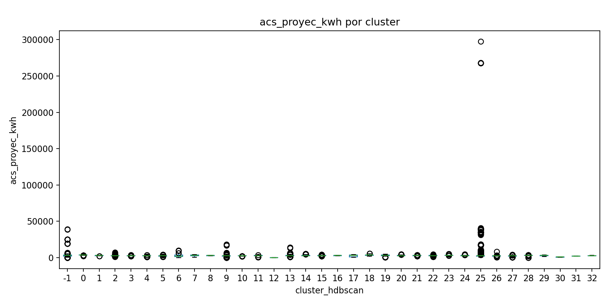

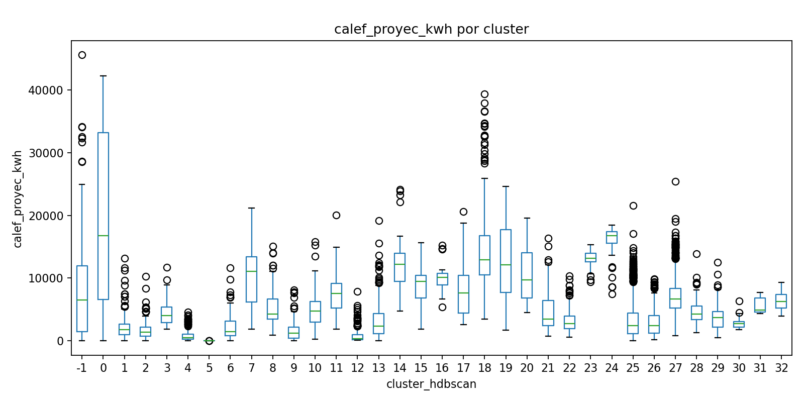

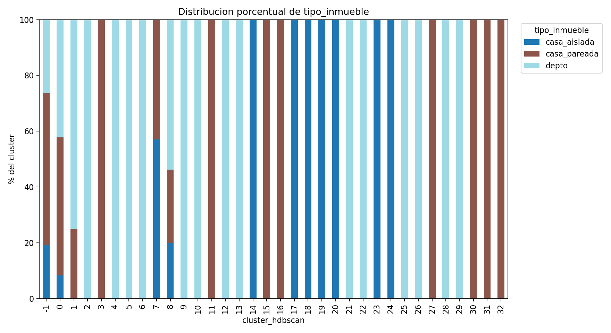

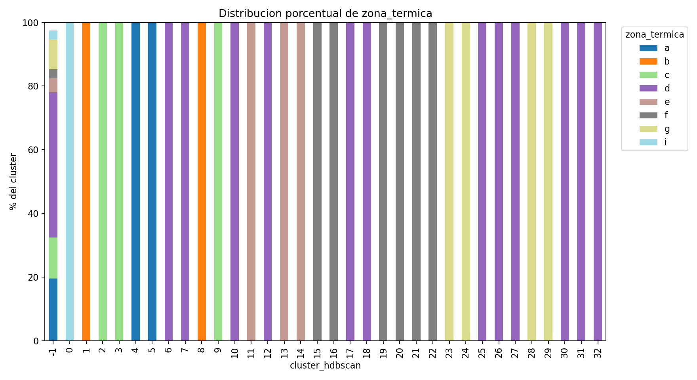

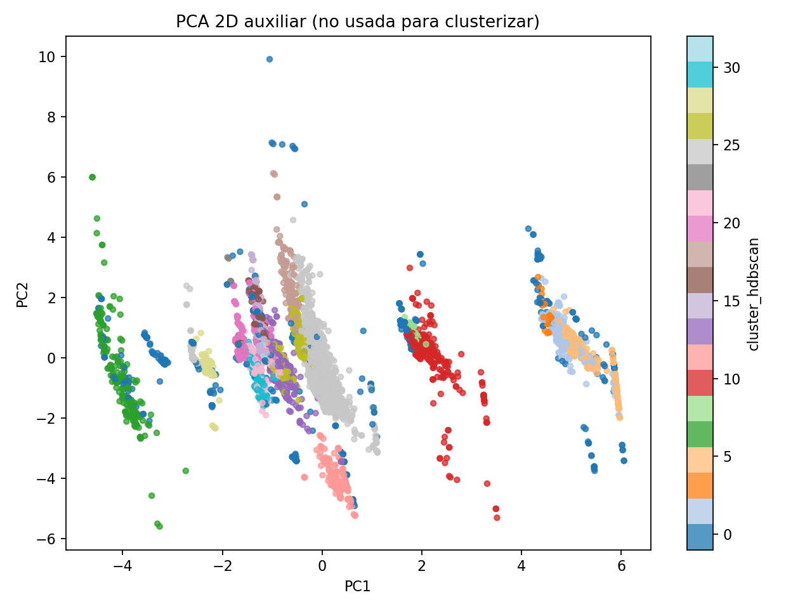

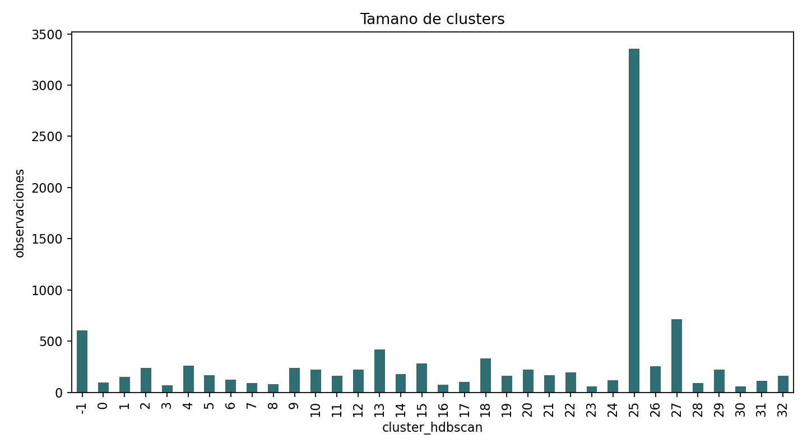

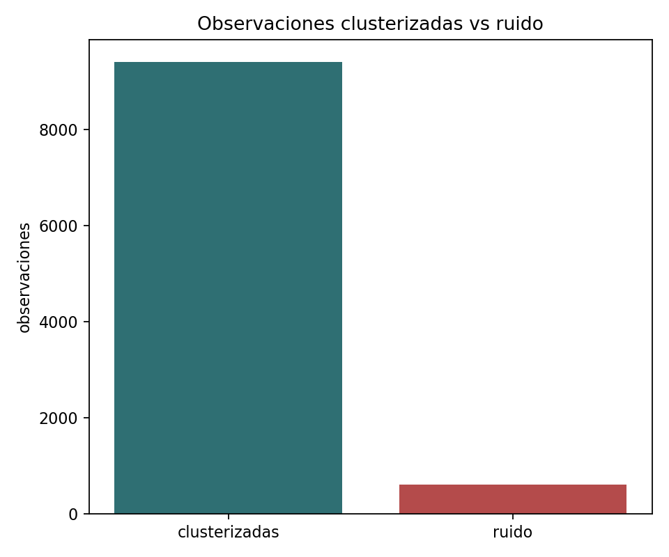

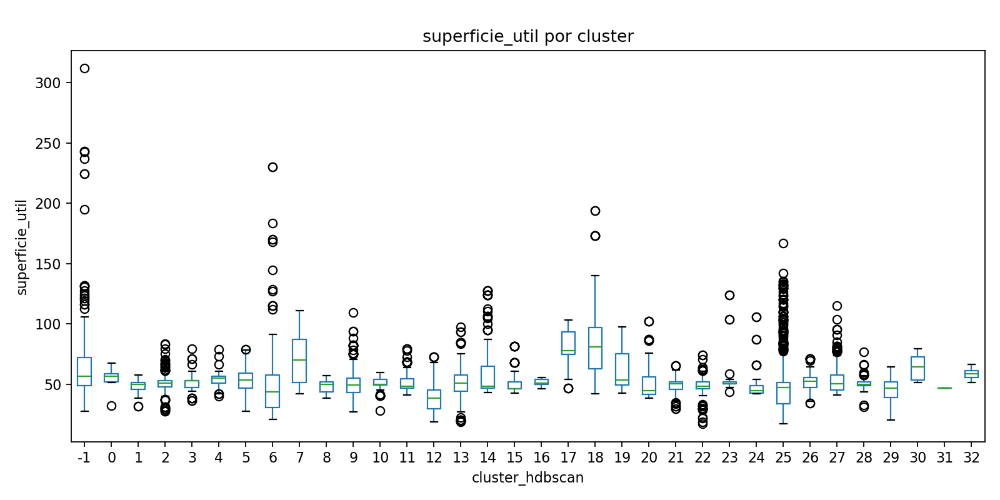

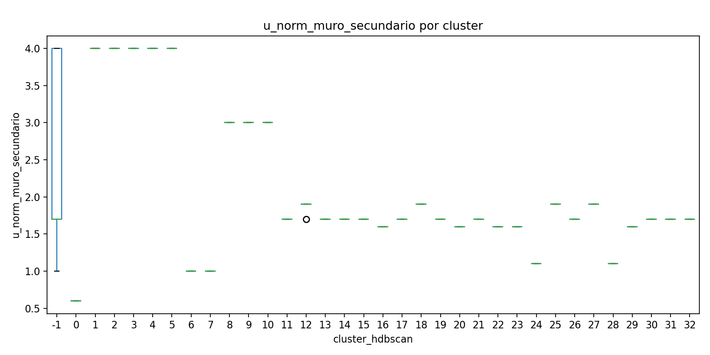

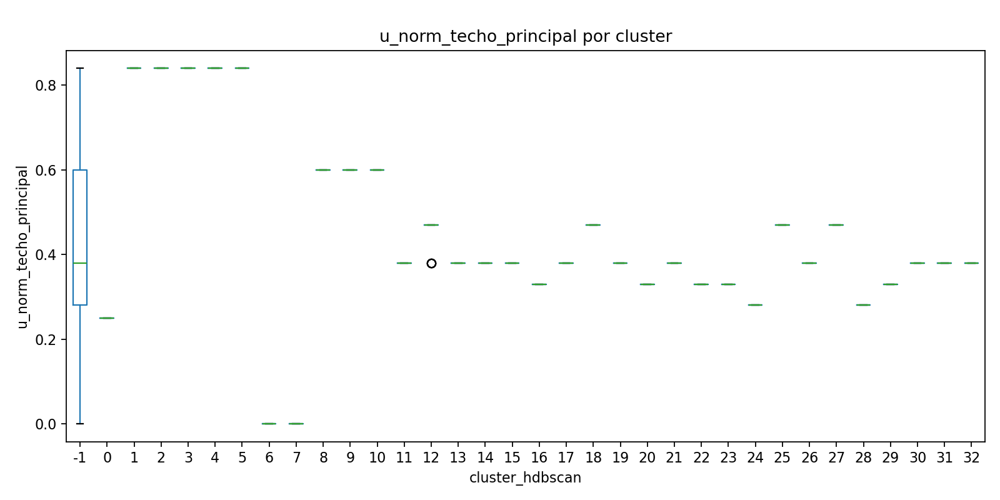

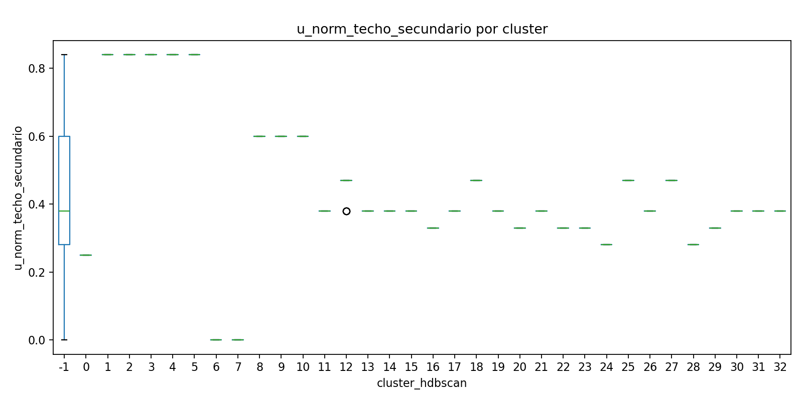

### Como leer el PCA 2D

El PCA 2D es una proyeccion auxiliar construida con variables numericas escaladas y categoricas codificadas con one-hot. No fue usado para clusterizar; solo sirve como mapa visual aproximado de similitudes. Puntos cercanos en el grafico tienden a compartir combinaciones parecidas de variables, y colores separados sugieren clusters visualmente distinguibles. Si dos colores se superponen, no significa necesariamente que HDBSCAN este mal: la proyeccion reduce muchas dimensiones a dos y puede esconder separaciones que existen en el espacio original de Gower.

## Analisis estadistico

Los estadisticos y pruebas Kruskal-Wallis o chi-cuadrado son exploratorios, no concluyentes, y no definen por si solos la validez tecnica de un cluster.

### Estadisticos globales numericos

| variable                |   count |     media |   mediana |   desviacion_estandar |   minimo |      p25 |      p75 |   maximo |   coeficiente_variacion |
|-------------------------|---------|-----------|-----------|-----------------------|----------|----------|----------|----------|-------------------------|
| superficie_util         |   10000 | 51.7759   |  49.6     |             17.4882   |     17.3 | 43.7     | 55.725   | 312.1    |                0.337768 |
| u_norm_muro_principal   |    9983 |  2.06705  |   1.9     |              0.76572  |      0.6 |  1.7     |  1.9     |   4      |                0.37044  |
| u_norm_muro_secundario  |    9983 |  2.06705  |   1.9     |              0.76572  |      0.6 |  1.7     |  1.9     |   4      |                0.37044  |
| u_norm_techo_principal  |    9983 |  0.461332 |   0.47    |              0.163589 |      0   |  0.38    |  0.47    |   0.84   |                0.354601 |
| u_norm_techo_secundario |    9983 |  0.461332 |   0.47    |              0.163589 |      0   |  0.38    |  0.47    |   0.84   |                0.354601 |
| log_calef_proyec_kwh    |   10000 |  7.79385  |   8.229   |              1.83667  |      0   |  7.28412 |  8.89206 |  10.7282 |                0.235656 |
| log_acs_proyec_kwh      |    9996 |  7.65139  |   7.87074 |              1.41807  |      0   |  7.74943 |  8.00451 |  12.6035 |                0.185335 |

### Estadisticos por cluster

|   cluster_hdbscan | variable                |   count |     media |   mediana |   desviacion_estandar |   minimo |      p25 |      p75 |    maximo |   coeficiente_variacion |
|-------------------|-------------------------|---------|-----------|-----------|-----------------------|----------|----------|----------|-----------|-------------------------|
|                -1 | superficie_util         |     602 | 63.3226   |  56.9     |          28.2953      | 27.8     | 49       | 72.2     | 312.1     |             0.446844    |
|                -1 | u_norm_muro_principal   |     585 |  2.49897  |   1.7     |           1.13237     |  1       |  1.7     |  4       |   4       |             0.453133    |
|                -1 | u_norm_muro_secundario  |     585 |  2.49897  |   1.7     |           1.13237     |  1       |  1.7     |  4       |   4       |             0.453133    |
|                -1 | u_norm_techo_principal  |     585 |  0.422906 |   0.38    |           0.277263    |  0       |  0.28    |  0.6     |   0.84    |             0.655614    |
|                -1 | u_norm_techo_secundario |     585 |  0.422906 |   0.38    |           0.277263    |  0       |  0.28    |  0.6     |   0.84    |             0.655614    |
|                -1 | log_calef_proyec_kwh    |     602 |  7.73682  |   8.78303 |           2.54698     |  0       |  7.27677 |  9.391   |  10.7282  |             0.329202    |
|                -1 | log_acs_proyec_kwh      |     602 |  7.31532  |   7.99193 |           2.416       |  0       |  7.76422 |  8.17709 |  10.5818  |             0.330265    |
|                 0 | superficie_util         |      97 | 56.3557   |  56.5     |           4.52746     | 32.3     | 52.3     | 58.6     |  67.5     |             0.0803373   |
|                 0 | u_norm_muro_principal   |      97 |  0.6      |   0.6     |           1.11599e-16 |  0.6     |  0.6     |  0.6     |   0.6     |             1.85998e-16 |
|                 0 | u_norm_muro_secundario  |      97 |  0.6      |   0.6     |           1.11599e-16 |  0.6     |  0.6     |  0.6     |   0.6     |             1.85998e-16 |
|                 0 | u_norm_techo_principal  |      97 |  0.25     |   0.25    |           0           |  0.25    |  0.25    |  0.25    |   0.25    |             0           |
|                 0 | u_norm_techo_secundario |      97 |  0.25     |   0.25    |           0           |  0.25    |  0.25    |  0.25    |   0.25    |             0           |
|                 0 | log_calef_proyec_kwh    |      97 |  8.62634  |   9.72766 |           2.83496     |  2.44235 |  8.78905 | 10.4102  |  10.6512  |             0.328639    |
|                 0 | log_acs_proyec_kwh      |      97 |  8.19644  |   8.22711 |           0.0966015   |  7.67192 |  8.16778 |  8.25338 |   8.35611 |             0.0117858   |
|                 1 | superficie_util         |     148 | 48.8662   |  50.2     |           4.36691     | 31.7     | 46.075   | 51.6     |  58       |             0.0893645   |
|                 1 | u_norm_muro_principal   |     148 |  4        |   4       |           0           |  4       |  4       |  4       |   4       |             0           |
|                 1 | u_norm_muro_secundario  |     148 |  4        |   4       |           0           |  4       |  4       |  4       |   4       |             0           |
|                 1 | u_norm_techo_principal  |     148 |  0.84     |   0.84    |           1.11399e-16 |  0.84    |  0.84    |  0.84    |   0.84    |             1.32618e-16 |
|                 1 | u_norm_techo_secundario |     148 |  0.84     |   0.84    |           1.11399e-16 |  0.84    |  0.84    |  0.84    |   0.84    |             1.32618e-16 |
|                 1 | log_calef_proyec_kwh    |     148 |  6.98183  |   7.48509 |           1.9633      |  0       |  6.91045 |  7.87559 |   9.48267 |             0.281201    |

### Como leer las pruebas exploratorias

Kruskal-Wallis se aplica a variables numericas y compara si las distribuciones por cluster tienden a tener rangos similares. Es una alternativa no parametrica a ANOVA: no exige normalidad y trabaja con ordenamientos/rangos. El estadistico H no esta en las unidades originales de la variable: para superficie no son m2, y para exigencias U tampoco son W/m2K. Es una medida de separacion entre rangos promedio de los clusters. No hay un umbral universal para decir alto o bajo, porque depende del tamano muestral y de los grados de libertad. Como referencia practica, se compara con una distribucion chi-cuadrado con `k - 1` grados de libertad, donde `k` es la cantidad de clusters comparados: si H es mucho mayor que esos grados de libertad y el p-value es muy pequeno, hay evidencia de diferencias entre clusters. Para interpretar magnitud, se reporta epsilon-cuadrado: valores cercanos a 0 sugieren efecto pequeno; alrededor de 0,01 pequeno, 0,06 moderado y 0,14 o mas grande, como regla orientativa.

Chi-cuadrado se aplica a variables categoricas y compara la tabla cluster x categoria contra lo que se esperaria si cluster y categoria fueran independientes. Su estadistico tampoco tiene unidades; resume cuanto se apartan las frecuencias observadas de las frecuencias esperadas bajo independencia. Tampoco hay un umbral universal: se evalua contra una distribucion chi-cuadrado con grados de libertad dados por `(filas - 1) * (columnas - 1)`. Como regla rapida, si el estadistico es mucho mayor que los grados de libertad y el p-value es pequeno, cluster y categoria no parecen independientes. Para magnitud se reporta V de Cramer, que va entre 0 y 1: cerca de 0 indica asociacion debil; alrededor de 0,1 baja, 0,3 moderada y 0,5 alta, aunque el contexto tecnico importa.

En esta corrida, p-values muy bajos sugieren que las variables analizadas efectivamente cambian entre clusters. La conclusion practica no es que los clusters sean automaticamente validos, sino que capturan diferencias observables en superficie, exigencias U, tipo de inmueble, zona termica y sistemas proyectados. Los tamanos de efecto ayudan a distinguir diferencias estadisticamente detectables de diferencias tecnicamente relevantes.

### Pruebas exploratorias

| variable                | tipo       | prueba                     |   estadistico |   p_value |   grados_libertad |   tamano_efecto | tamano_efecto_nombre   | nota                          |
|-------------------------|------------|----------------------------|---------------|-----------|-------------------|-----------------|------------------------|-------------------------------|
| superficie_util         | numerica   | Kruskal-Wallis             |       2375.79 |         0 |                32 |        0.250271 | epsilon_cuadrado       | Exploratoria, no concluyente. |
| u_norm_muro_principal   | numerica   | Kruskal-Wallis             |       9391.83 |         0 |                32 |        0.999448 | epsilon_cuadrado       | Exploratoria, no concluyente. |
| u_norm_muro_secundario  | numerica   | Kruskal-Wallis             |       9391.83 |         0 |                32 |        0.999448 | epsilon_cuadrado       | Exploratoria, no concluyente. |
| u_norm_techo_principal  | numerica   | Kruskal-Wallis             |       9391.83 |         0 |                32 |        0.999448 | epsilon_cuadrado       | Exploratoria, no concluyente. |
| u_norm_techo_secundario | numerica   | Kruskal-Wallis             |       9391.83 |         0 |                32 |        0.999448 | epsilon_cuadrado       | Exploratoria, no concluyente. |
| log_calef_proyec_kwh    | numerica   | Kruskal-Wallis             |       5416.46 |         0 |                32 |        0.574956 | epsilon_cuadrado       | Exploratoria, no concluyente. |
| log_acs_proyec_kwh      | numerica   | Kruskal-Wallis             |       2923.83 |         0 |                32 |        0.308924 | epsilon_cuadrado       | Exploratoria, no concluyente. |
| zona_termica            | categorica | Chi-cuadrado independencia |      65786    |         0 |               224 |        1        | v_cramer               | Exploratoria, no concluyente. |
| tipo_inmueble           | categorica | Chi-cuadrado independencia |      17890.8  |         0 |                64 |        0.975624 | v_cramer               | Exploratoria, no concluyente. |

## Perfil de arquetipos

## Arquetipo / Cluster 0

- Tamano del cluster: 97
- Porcentaje del total: 0.97%
- Etiqueta preliminar: casa_pareada | i | sup_mediana 56 m2 | calef: 16774 kWh | acs: 3740 kWh
- Silhouette promedio del cluster: 0.52055860271813
- Superficie util mediana: 56.5
- Zona termica dominante: i
- Tipo de inmueble dominante: casa_pareada
- Calefaccion proyectada dominante: 16774.2
- ACS proyectado dominante: 3740.0
- Exigencia U muro principal mediana: 0.6
- Exigencia U muro secundario mediana: 0.6
- Exigencia U techo principal mediana: 0.25
- Exigencia U techo secundario mediana: 0.25
- Vivienda representativa: ver `representantes_clusters.csv` y `representantes_clusters_filas_completas.csv`.
- Interpretacion tecnica preliminar: revisar el representante, los percentiles y la distribucion categorica antes de nombrar el arquetipo final.

## Arquetipo / Cluster 1

- Tamano del cluster: 148
- Porcentaje del total: 1.48%
- Etiqueta preliminar: depto | b | sup_mediana 50 m2 | calef: 1780 kWh | acs: 3096 kWh
- Silhouette promedio del cluster: 0.4989258604227685
- Superficie util mediana: 50.2
- Zona termica dominante: b
- Tipo de inmueble dominante: depto
- Calefaccion proyectada dominante: 1780.3
- ACS proyectado dominante: 3095.65
- Exigencia U muro principal mediana: 4.0
- Exigencia U muro secundario mediana: 4.0
- Exigencia U techo principal mediana: 0.84
- Exigencia U techo secundario mediana: 0.84
- Vivienda representativa: ver `representantes_clusters.csv` y `representantes_clusters_filas_completas.csv`.
- Interpretacion tecnica preliminar: revisar el representante, los percentiles y la distribucion categorica antes de nombrar el arquetipo final.

## Arquetipo / Cluster 2

- Tamano del cluster: 236
- Porcentaje del total: 2.36%
- Etiqueta preliminar: depto | c | sup_mediana 51 m2 | calef: 1345 kWh | acs: 2718 kWh
- Silhouette promedio del cluster: 0.825875241617088
- Superficie util mediana: 51.0
- Zona termica dominante: c
- Tipo de inmueble dominante: depto
- Calefaccion proyectada dominante: 1345.45
- ACS proyectado dominante: 2717.9
- Exigencia U muro principal mediana: 4.0
- Exigencia U muro secundario mediana: 4.0
- Exigencia U techo principal mediana: 0.84
- Exigencia U techo secundario mediana: 0.84
- Vivienda representativa: ver `representantes_clusters.csv` y `representantes_clusters_filas_completas.csv`.
- Interpretacion tecnica preliminar: revisar el representante, los percentiles y la distribucion categorica antes de nombrar el arquetipo final.

## Arquetipo / Cluster 3

- Tamano del cluster: 71
- Porcentaje del total: 0.71%
- Etiqueta preliminar: casa_pareada | c | sup_mediana 53 m2 | calef: 4048 kWh | acs: 2806 kWh
- Silhouette promedio del cluster: 0.9319944472708368
- Superficie util mediana: 53.1
- Zona termica dominante: c
- Tipo de inmueble dominante: casa_pareada
- Calefaccion proyectada dominante: 4047.8
- ACS proyectado dominante: 2805.5
- Exigencia U muro principal mediana: 4.0
- Exigencia U muro secundario mediana: 4.0
- Exigencia U techo principal mediana: 0.84
- Exigencia U techo secundario mediana: 0.84
- Vivienda representativa: ver `representantes_clusters.csv` y `representantes_clusters_filas_completas.csv`.
- Interpretacion tecnica preliminar: revisar el representante, los percentiles y la distribucion categorica antes de nombrar el arquetipo final.

## Arquetipo / Cluster 4

- Tamano del cluster: 258
- Porcentaje del total: 2.58%
- Etiqueta preliminar: depto | a | sup_mediana 55 m2 | calef: 473 kWh | acs: 2564 kWh
- Silhouette promedio del cluster: 0.6852765266699076
- Superficie util mediana: 55.0
- Zona termica dominante: a
- Tipo de inmueble dominante: depto
- Calefaccion proyectada dominante: 472.65
- ACS proyectado dominante: 2564.2
- Exigencia U muro principal mediana: 4.0
- Exigencia U muro secundario mediana: 4.0
- Exigencia U techo principal mediana: 0.84
- Exigencia U techo secundario mediana: 0.84
- Vivienda representativa: ver `representantes_clusters.csv` y `representantes_clusters_filas_completas.csv`.
- Interpretacion tecnica preliminar: revisar el representante, los percentiles y la distribucion categorica antes de nombrar el arquetipo final.

## Arquetipo / Cluster 5

- Tamano del cluster: 169
- Porcentaje del total: 1.69%
- Etiqueta preliminar: depto | a | sup_mediana 54 m2 | calef: 0 kWh | acs: 2514 kWh
- Silhouette promedio del cluster: 0.9080069762907712
- Superficie util mediana: 53.5
- Zona termica dominante: a
- Tipo de inmueble dominante: depto
- Calefaccion proyectada dominante: 0.0
- ACS proyectado dominante: 2513.8
- Exigencia U muro principal mediana: 4.0
- Exigencia U muro secundario mediana: 4.0
- Exigencia U techo principal mediana: 0.84
- Exigencia U techo secundario mediana: 0.84
- Vivienda representativa: ver `representantes_clusters.csv` y `representantes_clusters_filas_completas.csv`.
- Interpretacion tecnica preliminar: revisar el representante, los percentiles y la distribucion categorica antes de nombrar el arquetipo final.

## Arquetipo / Cluster 6

- Tamano del cluster: 123
- Porcentaje del total: 1.23%
- Etiqueta preliminar: depto | d | sup_mediana 44 m2 | calef: 1447 kWh | acs: 2330 kWh
- Silhouette promedio del cluster: 0.7722129924726159
- Superficie util mediana: 43.6
- Zona termica dominante: d
- Tipo de inmueble dominante: depto
- Calefaccion proyectada dominante: 1446.8
- ACS proyectado dominante: 2330.05
- Exigencia U muro principal mediana: 1.0
- Exigencia U muro secundario mediana: 1.0
- Exigencia U techo principal mediana: 0.0
- Exigencia U techo secundario mediana: 0.0
- Vivienda representativa: ver `representantes_clusters.csv` y `representantes_clusters_filas_completas.csv`.
- Interpretacion tecnica preliminar: revisar el representante, los percentiles y la distribucion categorica antes de nombrar el arquetipo final.

## Arquetipo / Cluster 7

- Tamano del cluster: 93
- Porcentaje del total: 0.93%
- Etiqueta preliminar: casa_aislada | d | sup_mediana 70 m2 | calef: 11088 kWh | acs: 3102 kWh
- Silhouette promedio del cluster: 0.5125341959588118
- Superficie util mediana: 70.0
- Zona termica dominante: d
- Tipo de inmueble dominante: casa_aislada
- Calefaccion proyectada dominante: 11088.0
- ACS proyectado dominante: 3101.5
- Exigencia U muro principal mediana: 1.0
- Exigencia U muro secundario mediana: 1.0
- Exigencia U techo principal mediana: 0.0
- Exigencia U techo secundario mediana: 0.0
- Vivienda representativa: ver `representantes_clusters.csv` y `representantes_clusters_filas_completas.csv`.
- Interpretacion tecnica preliminar: revisar el representante, los percentiles y la distribucion categorica antes de nombrar el arquetipo final.

## Arquetipo / Cluster 8

- Tamano del cluster: 80
- Porcentaje del total: 0.80%
- Etiqueta preliminar: depto | b | sup_mediana 50 m2 | calef: 4295 kWh | acs: 3062 kWh
- Silhouette promedio del cluster: 0.5326927238279195
- Superficie util mediana: 49.8
- Zona termica dominante: b
- Tipo de inmueble dominante: depto
- Calefaccion proyectada dominante: 4294.75
- ACS proyectado dominante: 3061.9
- Exigencia U muro principal mediana: 3.0
- Exigencia U muro secundario mediana: 3.0
- Exigencia U techo principal mediana: 0.6
- Exigencia U techo secundario mediana: 0.6
- Vivienda representativa: ver `representantes_clusters.csv` y `representantes_clusters_filas_completas.csv`.
- Interpretacion tecnica preliminar: revisar el representante, los percentiles y la distribucion categorica antes de nombrar el arquetipo final.

## Arquetipo / Cluster 9

- Tamano del cluster: 239
- Porcentaje del total: 2.39%
- Etiqueta preliminar: depto | c | sup_mediana 49 m2 | calef: 1243 kWh | acs: 2631 kWh
- Silhouette promedio del cluster: 0.7404384605241793
- Superficie util mediana: 49.3
- Zona termica dominante: c
- Tipo de inmueble dominante: depto
- Calefaccion proyectada dominante: 1242.6
- ACS proyectado dominante: 2631.3
- Exigencia U muro principal mediana: 3.0
- Exigencia U muro secundario mediana: 3.0
- Exigencia U techo principal mediana: 0.6
- Exigencia U techo secundario mediana: 0.6
- Vivienda representativa: ver `representantes_clusters.csv` y `representantes_clusters_filas_completas.csv`.
- Interpretacion tecnica preliminar: revisar el representante, los percentiles y la distribucion categorica antes de nombrar el arquetipo final.

## Arquetipo / Cluster 10

- Tamano del cluster: 224
- Porcentaje del total: 2.24%
- Etiqueta preliminar: depto | d | sup_mediana 50 m2 | calef: 4775 kWh | acs: 2496 kWh
- Silhouette promedio del cluster: 0.927588187095095
- Superficie util mediana: 49.9
- Zona termica dominante: d
- Tipo de inmueble dominante: depto
- Calefaccion proyectada dominante: 4775.4
- ACS proyectado dominante: 2495.6
- Exigencia U muro principal mediana: 3.0
- Exigencia U muro secundario mediana: 3.0
- Exigencia U techo principal mediana: 0.6
- Exigencia U techo secundario mediana: 0.6
- Vivienda representativa: ver `representantes_clusters.csv` y `representantes_clusters_filas_completas.csv`.
- Interpretacion tecnica preliminar: revisar el representante, los percentiles y la distribucion categorica antes de nombrar el arquetipo final.

## Arquetipo / Cluster 11

- Tamano del cluster: 163
- Porcentaje del total: 1.63%
- Etiqueta preliminar: casa_pareada | e | sup_mediana 48 m2 | calef: 7512 kWh | acs: 2658 kWh
- Silhouette promedio del cluster: 0.917619961157321
- Superficie util mediana: 48.3
- Zona termica dominante: e
- Tipo de inmueble dominante: casa_pareada
- Calefaccion proyectada dominante: 7511.7
- ACS proyectado dominante: 2657.7
- Exigencia U muro principal mediana: 1.7
- Exigencia U muro secundario mediana: 1.7
- Exigencia U techo principal mediana: 0.38
- Exigencia U techo secundario mediana: 0.38
- Vivienda representativa: ver `representantes_clusters.csv` y `representantes_clusters_filas_completas.csv`.
- Interpretacion tecnica preliminar: revisar el representante, los percentiles y la distribucion categorica antes de nombrar el arquetipo final.

## Arquetipo / Cluster 12

- Tamano del cluster: 223
- Porcentaje del total: 2.23%
- Etiqueta preliminar: depto | d | sup_mediana 39 m2 | calef: 322 kWh | acs: 0 kWh
- Silhouette promedio del cluster: 0.7999413820000231
- Superficie util mediana: 38.6
- Zona termica dominante: d
- Tipo de inmueble dominante: depto
- Calefaccion proyectada dominante: 322.4
- ACS proyectado dominante: 0.0
- Exigencia U muro principal mediana: 1.9
- Exigencia U muro secundario mediana: 1.9
- Exigencia U techo principal mediana: 0.47
- Exigencia U techo secundario mediana: 0.47
- Vivienda representativa: ver `representantes_clusters.csv` y `representantes_clusters_filas_completas.csv`.
- Interpretacion tecnica preliminar: revisar el representante, los percentiles y la distribucion categorica antes de nombrar el arquetipo final.

## Arquetipo / Cluster 13

- Tamano del cluster: 419
- Porcentaje del total: 4.19%
- Etiqueta preliminar: depto | e | sup_mediana 51 m2 | calef: 2301 kWh | acs: 2857 kWh
- Silhouette promedio del cluster: 0.8259290760098182
- Superficie util mediana: 51.0
- Zona termica dominante: e
- Tipo de inmueble dominante: depto
- Calefaccion proyectada dominante: 2301.4
- ACS proyectado dominante: 2857.2
- Exigencia U muro principal mediana: 1.7
- Exigencia U muro secundario mediana: 1.7
- Exigencia U techo principal mediana: 0.38
- Exigencia U techo secundario mediana: 0.38
- Vivienda representativa: ver `representantes_clusters.csv` y `representantes_clusters_filas_completas.csv`.
- Interpretacion tecnica preliminar: revisar el representante, los percentiles y la distribucion categorica antes de nombrar el arquetipo final.

## Arquetipo / Cluster 14

- Tamano del cluster: 180
- Porcentaje del total: 1.80%
- Etiqueta preliminar: casa_aislada | e | sup_mediana 48 m2 | calef: 12208 kWh | acs: 2718 kWh
- Silhouette promedio del cluster: 0.8970989389060122
- Superficie util mediana: 48.3
- Zona termica dominante: e
- Tipo de inmueble dominante: casa_aislada
- Calefaccion proyectada dominante: 12207.5
- ACS proyectado dominante: 2717.9
- Exigencia U muro principal mediana: 1.7
- Exigencia U muro secundario mediana: 1.7
- Exigencia U techo principal mediana: 0.38
- Exigencia U techo secundario mediana: 0.38
- Vivienda representativa: ver `representantes_clusters.csv` y `representantes_clusters_filas_completas.csv`.
- Interpretacion tecnica preliminar: revisar el representante, los percentiles y la distribucion categorica antes de nombrar el arquetipo final.

## Arquetipo / Cluster 15

- Tamano del cluster: 281
- Porcentaje del total: 2.81%
- Etiqueta preliminar: casa_pareada | f | sup_mediana 46 m2 | calef: 9445 kWh | acs: 2730 kWh
- Silhouette promedio del cluster: 0.6998598500321559
- Superficie util mediana: 46.2
- Zona termica dominante: f
- Tipo de inmueble dominante: casa_pareada
- Calefaccion proyectada dominante: 9445.2
- ACS proyectado dominante: 2729.7
- Exigencia U muro principal mediana: 1.7
- Exigencia U muro secundario mediana: 1.7
- Exigencia U techo principal mediana: 0.38
- Exigencia U techo secundario mediana: 0.38
- Vivienda representativa: ver `representantes_clusters.csv` y `representantes_clusters_filas_completas.csv`.
- Interpretacion tecnica preliminar: revisar el representante, los percentiles y la distribucion categorica antes de nombrar el arquetipo final.

## Arquetipo / Cluster 16

- Tamano del cluster: 75
- Porcentaje del total: 0.75%
- Etiqueta preliminar: casa_pareada | f | sup_mediana 51 m2 | calef: 10085 kWh | acs: 2954 kWh
- Silhouette promedio del cluster: 0.8702679691966946
- Superficie util mediana: 51.1
- Zona termica dominante: f
- Tipo de inmueble dominante: casa_pareada
- Calefaccion proyectada dominante: 10085.0
- ACS proyectado dominante: 2954.3
- Exigencia U muro principal mediana: 1.6
- Exigencia U muro secundario mediana: 1.6
- Exigencia U techo principal mediana: 0.33
- Exigencia U techo secundario mediana: 0.33
- Vivienda representativa: ver `representantes_clusters.csv` y `representantes_clusters_filas_completas.csv`.
- Interpretacion tecnica preliminar: revisar el representante, los percentiles y la distribucion categorica antes de nombrar el arquetipo final.

## Arquetipo / Cluster 17

- Tamano del cluster: 104
- Porcentaje del total: 1.04%
- Etiqueta preliminar: casa_aislada | d | sup_mediana 78 m2 | calef: 7627 kWh | acs: 3128 kWh
- Silhouette promedio del cluster: 0.69239350671457
- Superficie util mediana: 77.8
- Zona termica dominante: d
- Tipo de inmueble dominante: casa_aislada
- Calefaccion proyectada dominante: 7627.3
- ACS proyectado dominante: 3128.1
- Exigencia U muro principal mediana: 1.7
- Exigencia U muro secundario mediana: 1.7
- Exigencia U techo principal mediana: 0.38
- Exigencia U techo secundario mediana: 0.38
- Vivienda representativa: ver `representantes_clusters.csv` y `representantes_clusters_filas_completas.csv`.
- Interpretacion tecnica preliminar: revisar el representante, los percentiles y la distribucion categorica antes de nombrar el arquetipo final.

## Arquetipo / Cluster 18

- Tamano del cluster: 332
- Porcentaje del total: 3.32%
- Etiqueta preliminar: casa_aislada | d | sup_mediana 81 m2 | calef: 12934 kWh | acs: 3540 kWh
- Silhouette promedio del cluster: 0.7056079195155762
- Superficie util mediana: 81.1
- Zona termica dominante: d
- Tipo de inmueble dominante: casa_aislada
- Calefaccion proyectada dominante: 12933.6
- ACS proyectado dominante: 3540.1
- Exigencia U muro principal mediana: 1.9
- Exigencia U muro secundario mediana: 1.9
- Exigencia U techo principal mediana: 0.47
- Exigencia U techo secundario mediana: 0.47
- Vivienda representativa: ver `representantes_clusters.csv` y `representantes_clusters_filas_completas.csv`.
- Interpretacion tecnica preliminar: revisar el representante, los percentiles y la distribucion categorica antes de nombrar el arquetipo final.

## Arquetipo / Cluster 19

- Tamano del cluster: 159
- Porcentaje del total: 1.59%
- Etiqueta preliminar: casa_aislada | f | sup_mediana 53 m2 | calef: 12106 kWh | acs: 2978 kWh
- Silhouette promedio del cluster: 0.5371803552137098
- Superficie util mediana: 53.4
- Zona termica dominante: f
- Tipo de inmueble dominante: casa_aislada
- Calefaccion proyectada dominante: 12105.6
- ACS proyectado dominante: 2977.9
- Exigencia U muro principal mediana: 1.7
- Exigencia U muro secundario mediana: 1.7
- Exigencia U techo principal mediana: 0.38
- Exigencia U techo secundario mediana: 0.38
- Vivienda representativa: ver `representantes_clusters.csv` y `representantes_clusters_filas_completas.csv`.
- Interpretacion tecnica preliminar: revisar el representante, los percentiles y la distribucion categorica antes de nombrar el arquetipo final.

## Arquetipo / Cluster 20

- Tamano del cluster: 219
- Porcentaje del total: 2.19%
- Etiqueta preliminar: casa_aislada | f | sup_mediana 45 m2 | calef: 9726 kWh | acs: 2665 kWh
- Silhouette promedio del cluster: 0.6803844693349178
- Superficie util mediana: 44.8
- Zona termica dominante: f
- Tipo de inmueble dominante: casa_aislada
- Calefaccion proyectada dominante: 9726.5
- ACS proyectado dominante: 2665.0
- Exigencia U muro principal mediana: 1.6
- Exigencia U muro secundario mediana: 1.6
- Exigencia U techo principal mediana: 0.33
- Exigencia U techo secundario mediana: 0.33
- Vivienda representativa: ver `representantes_clusters.csv` y `representantes_clusters_filas_completas.csv`.
- Interpretacion tecnica preliminar: revisar el representante, los percentiles y la distribucion categorica antes de nombrar el arquetipo final.

## Arquetipo / Cluster 21

- Tamano del cluster: 167
- Porcentaje del total: 1.67%
- Etiqueta preliminar: depto | f | sup_mediana 51 m2 | calef: 3453 kWh | acs: 2932 kWh
- Silhouette promedio del cluster: 0.619778463007296
- Superficie util mediana: 50.6
- Zona termica dominante: f
- Tipo de inmueble dominante: depto
- Calefaccion proyectada dominante: 3453.0
- ACS proyectado dominante: 2932.0
- Exigencia U muro principal mediana: 1.7
- Exigencia U muro secundario mediana: 1.7
- Exigencia U techo principal mediana: 0.38
- Exigencia U techo secundario mediana: 0.38
- Vivienda representativa: ver `representantes_clusters.csv` y `representantes_clusters_filas_completas.csv`.
- Interpretacion tecnica preliminar: revisar el representante, los percentiles y la distribucion categorica antes de nombrar el arquetipo final.

## Arquetipo / Cluster 22

- Tamano del cluster: 196
- Porcentaje del total: 1.96%
- Etiqueta preliminar: depto | f | sup_mediana 49 m2 | calef: 2759 kWh | acs: 2842 kWh
- Silhouette promedio del cluster: 0.6675726861601233
- Superficie util mediana: 48.6
- Zona termica dominante: f
- Tipo de inmueble dominante: depto
- Calefaccion proyectada dominante: 2758.6000000000004
- ACS proyectado dominante: 2842.0
- Exigencia U muro principal mediana: 1.6
- Exigencia U muro secundario mediana: 1.6
- Exigencia U techo principal mediana: 0.33
- Exigencia U techo secundario mediana: 0.33
- Vivienda representativa: ver `representantes_clusters.csv` y `representantes_clusters_filas_completas.csv`.
- Interpretacion tecnica preliminar: revisar el representante, los percentiles y la distribucion categorica antes de nombrar el arquetipo final.

## Arquetipo / Cluster 23

- Tamano del cluster: 56
- Porcentaje del total: 0.56%
- Etiqueta preliminar: casa_aislada | g | sup_mediana 50 m2 | calef: 13182 kWh | acs: 3014 kWh
- Silhouette promedio del cluster: 0.9071210515580028
- Superficie util mediana: 50.3
- Zona termica dominante: g
- Tipo de inmueble dominante: casa_aislada
- Calefaccion proyectada dominante: 13182.0
- ACS proyectado dominante: 3013.8
- Exigencia U muro principal mediana: 1.6
- Exigencia U muro secundario mediana: 1.6
- Exigencia U techo principal mediana: 0.33
- Exigencia U techo secundario mediana: 0.33
- Vivienda representativa: ver `representantes_clusters.csv` y `representantes_clusters_filas_completas.csv`.
- Interpretacion tecnica preliminar: revisar el representante, los percentiles y la distribucion categorica antes de nombrar el arquetipo final.

## Arquetipo / Cluster 24

- Tamano del cluster: 119
- Porcentaje del total: 1.19%
- Etiqueta preliminar: casa_aislada | g | sup_mediana 45 m2 | calef: 16757 kWh | acs: 2751 kWh
- Silhouette promedio del cluster: 0.9101056818120856
- Superficie util mediana: 44.8
- Zona termica dominante: g
- Tipo de inmueble dominante: casa_aislada
- Calefaccion proyectada dominante: 16756.7
- ACS proyectado dominante: 2750.8
- Exigencia U muro principal mediana: 1.1
- Exigencia U muro secundario mediana: 1.1
- Exigencia U techo principal mediana: 0.28
- Exigencia U techo secundario mediana: 0.28
- Vivienda representativa: ver `representantes_clusters.csv` y `representantes_clusters_filas_completas.csv`.
- Interpretacion tecnica preliminar: revisar el representante, los percentiles y la distribucion categorica antes de nombrar el arquetipo final.

## Arquetipo / Cluster 25

- Tamano del cluster: 3354
- Porcentaje del total: 33.54%
- Etiqueta preliminar: depto | d | sup_mediana 47 m2 | calef: 2398 kWh | acs: 2438 kWh
- Silhouette promedio del cluster: 0.5932735649481168
- Superficie util mediana: 47.2
- Zona termica dominante: d
- Tipo de inmueble dominante: depto
- Calefaccion proyectada dominante: 2398.5
- ACS proyectado dominante: 2438.1
- Exigencia U muro principal mediana: 1.9
- Exigencia U muro secundario mediana: 1.9
- Exigencia U techo principal mediana: 0.47
- Exigencia U techo secundario mediana: 0.47
- Vivienda representativa: ver `representantes_clusters.csv` y `representantes_clusters_filas_completas.csv`.
- Interpretacion tecnica preliminar: revisar el representante, los percentiles y la distribucion categorica antes de nombrar el arquetipo final.

## Arquetipo / Cluster 26

- Tamano del cluster: 255
- Porcentaje del total: 2.55%
- Etiqueta preliminar: depto | d | sup_mediana 52 m2 | calef: 2440 kWh | acs: 2486 kWh
- Silhouette promedio del cluster: 0.7630935844631963
- Superficie util mediana: 52.4
- Zona termica dominante: d
- Tipo de inmueble dominante: depto
- Calefaccion proyectada dominante: 2440.3
- ACS proyectado dominante: 2485.7
- Exigencia U muro principal mediana: 1.7
- Exigencia U muro secundario mediana: 1.7
- Exigencia U techo principal mediana: 0.38
- Exigencia U techo secundario mediana: 0.38
- Vivienda representativa: ver `representantes_clusters.csv` y `representantes_clusters_filas_completas.csv`.
- Interpretacion tecnica preliminar: revisar el representante, los percentiles y la distribucion categorica antes de nombrar el arquetipo final.

## Arquetipo / Cluster 27

- Tamano del cluster: 714
- Porcentaje del total: 7.14%
- Etiqueta preliminar: casa_pareada | d | sup_mediana 51 m2 | calef: 6622 kWh | acs: 2482 kWh
- Silhouette promedio del cluster: 0.7572783053779208
- Superficie util mediana: 50.7
- Zona termica dominante: d
- Tipo de inmueble dominante: casa_pareada
- Calefaccion proyectada dominante: 6621.9
- ACS proyectado dominante: 2482.0
- Exigencia U muro principal mediana: 1.9
- Exigencia U muro secundario mediana: 1.9
- Exigencia U techo principal mediana: 0.47
- Exigencia U techo secundario mediana: 0.47
- Vivienda representativa: ver `representantes_clusters.csv` y `representantes_clusters_filas_completas.csv`.
- Interpretacion tecnica preliminar: revisar el representante, los percentiles y la distribucion categorica antes de nombrar el arquetipo final.

## Arquetipo / Cluster 28

- Tamano del cluster: 93
- Porcentaje del total: 0.93%
- Etiqueta preliminar: depto | g | sup_mediana 50 m2 | calef: 4233 kWh | acs: 2993 kWh
- Silhouette promedio del cluster: 0.8067963402401934
- Superficie util mediana: 49.8
- Zona termica dominante: g
- Tipo de inmueble dominante: depto
- Calefaccion proyectada dominante: 4233.2
- ACS proyectado dominante: 2993.3
- Exigencia U muro principal mediana: 1.1
- Exigencia U muro secundario mediana: 1.1
- Exigencia U techo principal mediana: 0.28
- Exigencia U techo secundario mediana: 0.28
- Vivienda representativa: ver `representantes_clusters.csv` y `representantes_clusters_filas_completas.csv`.
- Interpretacion tecnica preliminar: revisar el representante, los percentiles y la distribucion categorica antes de nombrar el arquetipo final.

## Arquetipo / Cluster 29

- Tamano del cluster: 219
- Porcentaje del total: 2.19%
- Etiqueta preliminar: depto | g | sup_mediana 47 m2 | calef: 3716 kWh | acs: 2948 kWh
- Silhouette promedio del cluster: 0.803257645172246
- Superficie util mediana: 46.8
- Zona termica dominante: g
- Tipo de inmueble dominante: depto
- Calefaccion proyectada dominante: 3715.7
- ACS proyectado dominante: 2947.9
- Exigencia U muro principal mediana: 1.6
- Exigencia U muro secundario mediana: 1.6
- Exigencia U techo principal mediana: 0.33
- Exigencia U techo secundario mediana: 0.33
- Vivienda representativa: ver `representantes_clusters.csv` y `representantes_clusters_filas_completas.csv`.
- Interpretacion tecnica preliminar: revisar el representante, los percentiles y la distribucion categorica antes de nombrar el arquetipo final.

## Arquetipo / Cluster 30

- Tamano del cluster: 60
- Porcentaje del total: 0.60%
- Etiqueta preliminar: casa_pareada | d | sup_mediana 64 m2 | calef: 2762 kWh | acs: 873 kWh
- Silhouette promedio del cluster: 0.5651325916684499
- Superficie util mediana: 64.35
- Zona termica dominante: d
- Tipo de inmueble dominante: casa_pareada
- Calefaccion proyectada dominante: 2761.65
- ACS proyectado dominante: 873.3
- Exigencia U muro principal mediana: 1.7
- Exigencia U muro secundario mediana: 1.7
- Exigencia U techo principal mediana: 0.38
- Exigencia U techo secundario mediana: 0.38
- Vivienda representativa: ver `representantes_clusters.csv` y `representantes_clusters_filas_completas.csv`.
- Interpretacion tecnica preliminar: revisar el representante, los percentiles y la distribucion categorica antes de nombrar el arquetipo final.

## Arquetipo / Cluster 31

- Tamano del cluster: 112
- Porcentaje del total: 1.12%
- Etiqueta preliminar: casa_pareada | d | sup_mediana 47 m2 | calef: 4928 kWh | acs: 2382 kWh
- Silhouette promedio del cluster: 0.7224532956772739
- Superficie util mediana: 47.0
- Zona termica dominante: d
- Tipo de inmueble dominante: casa_pareada
- Calefaccion proyectada dominante: 4927.5
- ACS proyectado dominante: 2381.7
- Exigencia U muro principal mediana: 1.7
- Exigencia U muro secundario mediana: 1.7
- Exigencia U techo principal mediana: 0.38
- Exigencia U techo secundario mediana: 0.38
- Vivienda representativa: ver `representantes_clusters.csv` y `representantes_clusters_filas_completas.csv`.
- Interpretacion tecnica preliminar: revisar el representante, los percentiles y la distribucion categorica antes de nombrar el arquetipo final.

## Arquetipo / Cluster 32

- Tamano del cluster: 160
- Porcentaje del total: 1.60%
- Etiqueta preliminar: casa_pareada | d | sup_mediana 59 m2 | calef: 6283 kWh | acs: 2824 kWh
- Silhouette promedio del cluster: 0.3971636773442523
- Superficie util mediana: 58.7
- Zona termica dominante: d
- Tipo de inmueble dominante: casa_pareada
- Calefaccion proyectada dominante: 6283.35
- ACS proyectado dominante: 2824.1
- Exigencia U muro principal mediana: 1.7
- Exigencia U muro secundario mediana: 1.7
- Exigencia U techo principal mediana: 0.38
- Exigencia U techo secundario mediana: 0.38
- Vivienda representativa: ver `representantes_clusters.csv` y `representantes_clusters_filas_completas.csv`.
- Interpretacion tecnica preliminar: revisar el representante, los percentiles y la distribucion categorica antes de nombrar el arquetipo final.

## Observaciones ruido

- Cantidad: 602
- Porcentaje: 6.02%
- Posible interpretacion: casos atipicos, combinaciones poco frecuentes o datos inconsistentes. Se recomienda revision tecnica.

## Limitaciones

- No se cuenta con año de construcción.
- Los clusters dependen de las variables disponibles.
- Gower + HDBSCAN identifica similitud estadistica, no causalidad.
- Las etiquetas de arquetipo son preliminares.
- La calidad depende de limpieza y consistencia de las fichas CEV.
- No se debe usar silhouette como unico criterio de validez.

## Conclusiones

Los clusters mas representativos corresponden a los grupos con mayor cantidad de observaciones en `resumen_clusters.csv`. Una alta proporcion de ruido debe interpretarse como senal para revisar parametros, calidad de datos o heterogeneidad real. La siguiente etapa recomendada es revisar tecnicamente las viviendas representantes por cluster.

## Archivos generados

- `../outputs/clustering_cev/config_clustering.json`
- `../outputs/clustering_cev/estadisticos_clusters_categoricos.csv`
- `../outputs/clustering_cev/estadisticos_clusters_numericos.csv`
- `../outputs/clustering_cev/estadisticos_globales_categoricos.csv`
- `../outputs/clustering_cev/estadisticos_globales_numericos.csv`
- `../outputs/clustering_cev/fichas_cev_clusterizadas.csv`
- `../outputs/clustering_cev/fichas_cev_clusterizadas.parquet`
- `../outputs/clustering_cev/figures/acs_proyec_kwh_by_cluster.png`
- `../outputs/clustering_cev/figures/calef_proyec_kwh_by_cluster.png`
- `../outputs/clustering_cev/figures/categoria_tipo_inmueble_by_cluster.png`
- `../outputs/clustering_cev/figures/categoria_zona_termica_by_cluster.png`
- `../outputs/clustering_cev/figures/cluster_pca_2d.png`
- `../outputs/clustering_cev/figures/cluster_sizes.png`
- `../outputs/clustering_cev/figures/noise_share.png`
- `../outputs/clustering_cev/figures/superficie_util_by_cluster.png`
- `../outputs/clustering_cev/figures/u_norm_muro_principal_by_cluster.png`
- `../outputs/clustering_cev/figures/u_norm_muro_secundario_by_cluster.png`
- `../outputs/clustering_cev/figures/u_norm_techo_principal_by_cluster.png`
- `../outputs/clustering_cev/figures/u_norm_techo_secundario_by_cluster.png`
- `../outputs/clustering_cev/metricas_clustering.json`
- `../outputs/clustering_cev/missing_values_report.csv`
- `../outputs/clustering_cev/perfil_categorico_clusters.csv`
- `../outputs/clustering_cev/perfil_numerico_clusters.csv`
- `../outputs/clustering_cev/pruebas_estadisticas_exploratorias.csv`
- `../outputs/clustering_cev/representantes_clusters.csv`
- `../outputs/clustering_cev/representantes_clusters_filas_completas.csv`
- `../outputs/clustering_cev/resumen_clusters.csv`
- `../outputs/clustering_cev/silhouette_clusters.csv`
